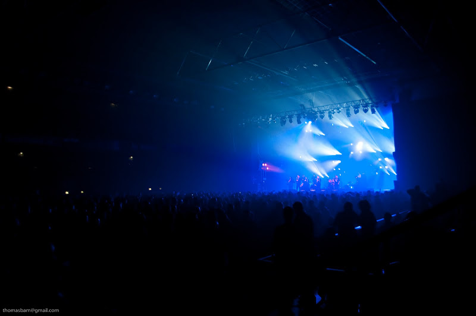

Lundi dans le coton, mais pour une bonne raison : 3 jours à Rennes pour la 31e édition des Transmusicales. Cette année, la programmation paraissait alléchante, et elle a tenu toutes ses promesses. Déjà, nous avons pu retrouver jeudi soir le Liberté, salle qui se trouve en centre-ville. Elle était en rénovation depuis plusieurs années, et le gros de la programmation s'était retrouvé depuis l'édition 2004 exilé au Parc Expo à 1/2h de bus du centre. Sympa de pouvoir rester dans le centre le soir de l'arrivée, et d'avoir une soirée un peu moins énorme que dans les grands halls du parc expo.

Malgré cela, décalage obligé du premier soir, avec l'excitation de 3 jours de musique à venir, les retrouvailles, les décibels, les couleurs et les flash des projecteurs, les 5000 personnes déjà présentes ce soir là, les effluves de clopes, d'alcool et autres psychotropes. Petite déception, à cause d'un retard de mon train j'ai raté [V.V. Brown](http://www.youtube.com/watch?v=m3-Q4T7bC2c) qui a fait, on l'a su le lendemain une bonne impression, malgré de vrais coeurs absents, c'était la BO de la [bande annonce des trans](http://www.dailymotion.com/video/xb9pjw_bande-annonce-officielle-trans-musi_music) cette anné. Raté également [Beast](http://www.myspace.com/beastsound) qui a fait fort, en remplissant la salle du haut de 800 places, laissant les moins chanceux dehors. Apparemment, nous aurons l'occasion de les revoir...

On a rattrapé le cours du festival en commençant avec [Abraham Inc](http://www.myspace.com/abrahamincmusic), jazz-rap carré et inventif, mélodies un peu dans le style musique juive, et pour cause, c'est la rencontre entre un clarinettiste klezmer, David Krakauer, un tromboniste de James Brown (Fred Wesley), et un rappeur (Socalled). Des séniors qui se font plaisir sur scène. Grosse section de cuivre et impros. Nous avons entrevu [Hook And The Twin](http://www.myspace.com/hookandthetwin) à l'étage (sorte de Beck en plus froid et rock) avant de redescendre dans la grand salle pour un set de [Oof](http://www.myspace.com/cinemix). C'est un mix calé sur des images, une sorte de melting pot de vieux trucs par désagréables à réentendre comme par exemple Nena, B52's, A-HA, Beastie Boys. Agréable, même avec des transitions un peu hasardeuses.

Ensuite c'était Vrelo. Groupe composé de 6 chanteuses et deux musiciens. Sorte de Dead Can Dance flolklorique slovène survolté. La scénographie était très axée sur la plastique des chanteuses : pantalon blanc prêt du corps et chorégraphies élaborées.

Du coup les premiers rangs étaient essentiellement des hommes qui commentaient :

> Tu prends la quelle ? Toutes ! (monsieur est gourmand) (plus loin) Quand même elle est bonne la seconde à droite (plusieurs fois entendu d'ailleurs)

J'ai trouvé que ça déservait leur musique, on est bien aux trans et pas au moulin rouge. La programmation étant finie, après quelques canons, retour à l'hôtel à pied, paisible, il reste 2 soirs...
