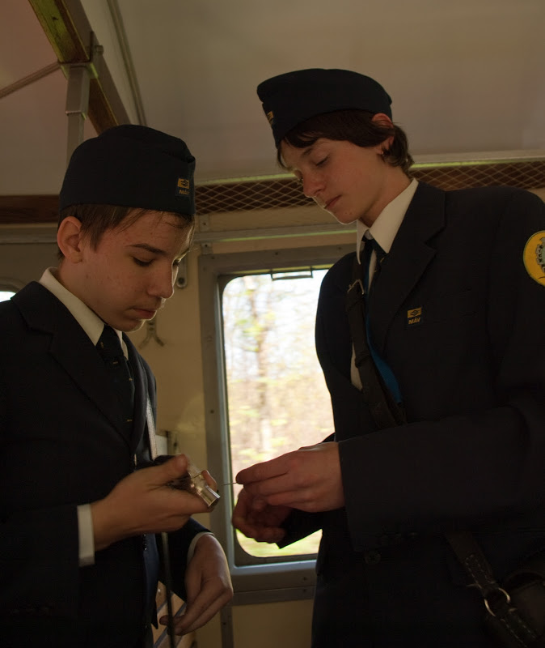
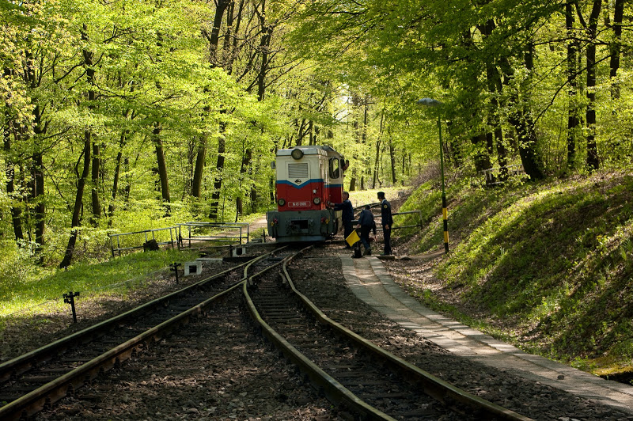
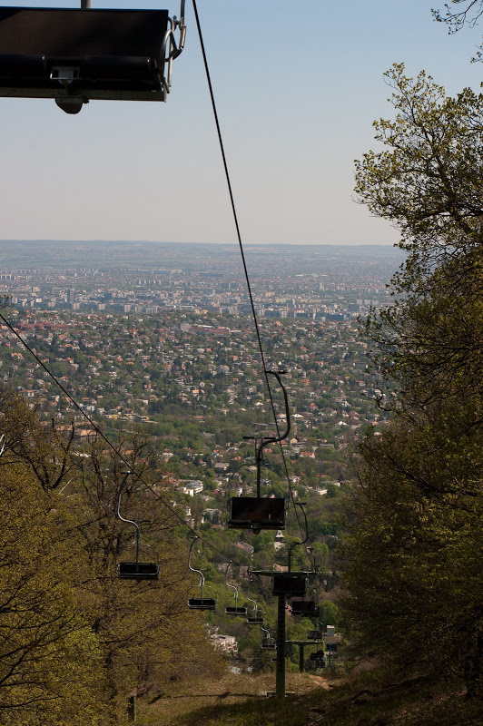

Au terminus de la ligne 56 du tramway, à Hüvösvölgy se trouve une gare. Cette gare est un peu particulière car vous serez accueillis par des enfants.

Depuis 1948 circule le train des enfants qui serpente dans les collines au nord-ouest de Budapest. Il part toutes les heures, et fait une dizaine d'arrêts jusqu'à Széchenyi-hegy. Vestige du communisme, le service est assuré par des enfants ayant de bons résultats scolaires.

Vous pouvez vous arrêter au milieu et partir vous promener sur les multiples chemins dans la forêt. Ca fait une petite promenade bien sympa qui plaît aux enfants. Vous pouvez même redescendre en télésiège en vous arrêtant à Jànos-Hegy puis en suivant un chemin pédestre (la direction est indiquée).

Un [petit film](http://vimeo.com/7594619) de RFI montre bien l'ambiance également.
