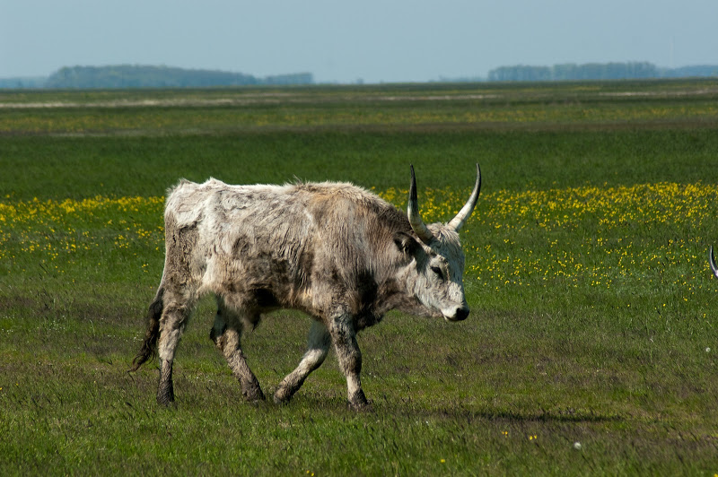
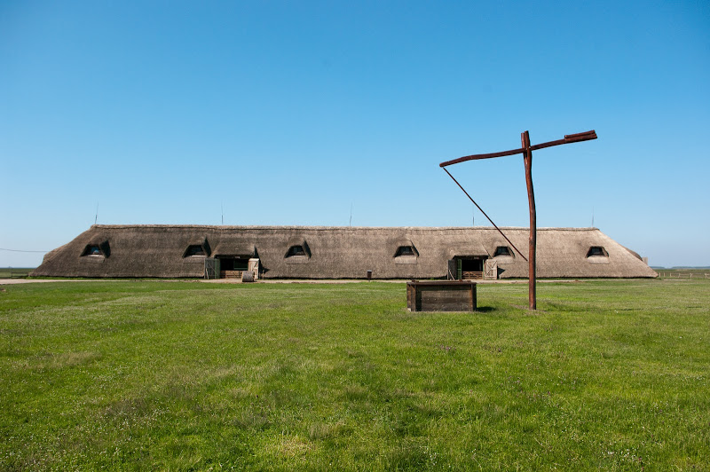

Si vous aimez le cheval et/ou que vous aimez les grands espaces sauvages, vous pouvez aller en Hongrie dans ce parc. Il fait partie du [patrimoine mondial de l'UNESCO](http://whc.unesco.org/fr/list/474) depuis 1973. Ce sont 82.000 hectares de prairies et de marécages, avec une faune impressionnante : des buffles d'eau, des chevaux, beaucoup d'espèces d'oiseaux, des lièvres, moutons, cochons sauvages, boeufs gris, et bien d'autres animaux. Vous pouvez y rencontrer des gens vivant de l'élevage depuis 2000 ans.

Vous pouvez par exemple, si vous êtes bon cavalier aller faire des ballades à cheval dans ces étendues, ou bien faire un tour de roulote en vous rendant au haras de Máta :

Ils ont 250 chevaux, et organisent des spectacles, ou des promenades équestres. Même moi qui n'aie jamais été particulièrement fan de bourrin, j'ai trouvé ce petit tour en roulote très intéressant pour 1h 1/2 au trot avec 5 arrêts :

- une visite des ânes et des cochons sauvages
- une visite des jeunes chevaux avant dressage
- une visite des boeufs gris
- un spectacle équestre en plein parc
- une visite de l'étable

