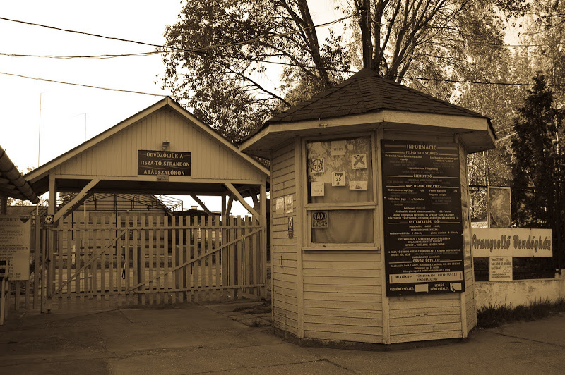
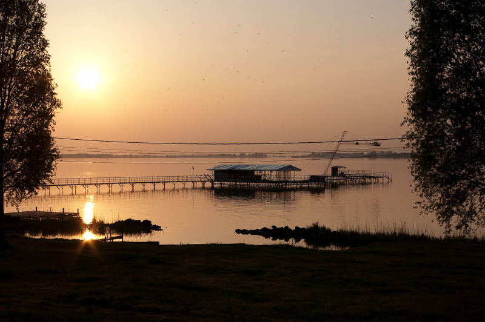

[Station balnéaire au bord du lac Tisza](http://www.szalok.hu/), elle permet d'imaginer facilement comment étaient les centres de vacances de l'ancien bloc communiste. En avril, saison morte, vous avez l'impression que tout le monde a déserté en laissant les choses comme elles étaient. C'est un peu surréaliste, comme cette plateforme qui mène à un téléski-nautique composé de quatre gros pylônes paraissant avoir été engloutis par les eaux du lac.

Patrick de [Tisza Lodge](http://www.lagrappe.net/tisza-lodge) nous a dit que la période pleine commence début juillet pour finir vers le 20 août. En dehors de ces 6 semaines, apparemment il ne s'y passe pas grand chose. On a juste croisé un couple qui se promenait et une famille en vélo.

Cependant, il parait qu'en été des concerts sont programmés (il y a une scène dehors), de nombreuses activités nautiques sont possibles. Et puis l'endroit est très beau. On a eu en plus la chance d'y passer au coucher de soleil d'une belle journée. Ça donnait un peu l'impression d'assister au crépuscule du communisme.

