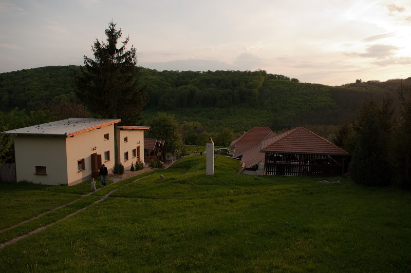

De même que pour [Tisza Lodge](http://www.lagrappe.net/tisza-lodge), si vous cherchez une chambre d'hôtes dans la nature aux alentours du lac Balaton cette fois-ci, vous pouvez aller à [Kalandor Resort](http://kalandor.nl/). Ce sont de petites maisons indépendantes pour quatre personnes, avec une cuisine.

Ces maisons d'hôtes ont été réalisées par 2 néerlandais très sympas, Erik et Gerrit qui ont plaqué leurs anciens boulots pour se lancer dans cette aventure. Ils pourront vous expliquer tout ça en partageant votre table si vous le souhaitez, et s'ils sont disponibles. Ils vous proposeront une cuisine simple, locale (comme des salades hongroises, le fameux Goulash, Rétes pour nous), et bien faite. Ils pourront aussi vous renseigner sur les nombreux endroits où aller dans les alentours ou les balades à faire.

L'originalité c'est cette cave sous terre en Y (la porte ouverte au milieu ci-dessus) avec une branche salon-télé et une branche bibliothèque. Dans la branche principale se trouve une salle à manger. Ils l'ont restaurée car elle abritait une cave à vin, et assure une climatisation naturelle l'été.

Vous trouverez plus de photos dans [cet album](http://picasaweb.google.com/thomasbam/Zalacsany). Une dernière chose, pour s'y rendre c'est pas évident alors voici les coordonnées : [+46° 49' 37.04", +17° 4' 45.35" (46.826956, 17.079265)](http://maps.google.fr/maps?q=46.826956,17.079265&num=1&t=h&sll=46.807499,17.09597&sspn=0.061114,0.128059&ie=UTF8&ll=46.82657,17.07917&spn=0.003146,0.006925&z=18&iwloc=A)
