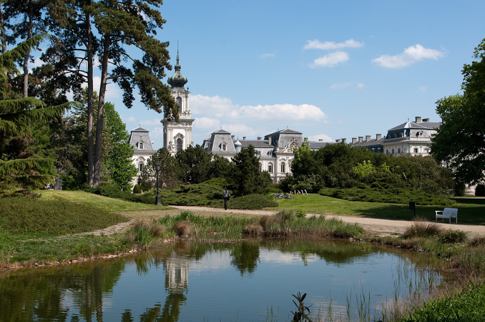
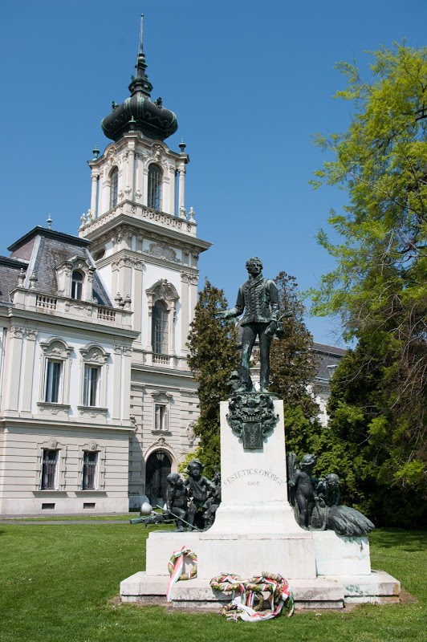

Kesthely est une ville située à l'extrême ouest du lac. Ses plages sont moins fréquentées que celles des villes proches de Budapest (en été car au moment où nous y étions, il n'y avait personne). Les deux plages sont jolies et font un peu penser aux plages d'Annecy.

L'attraction principale est le château des Festetics construit au XVIIIe siècle et habité par la famille Festetics jusqu'en 1945. Sa construction a duré plus d'un siècle, mais en valait la peine : c'est une architecture élégante et peu ostentatoire. Il n'est pas très haut, il n'a pas beaucoup de statues, peu d'ornements, ou autre dentelle. C'est très agréable de se promener dans son parc, voire d'y pique-niquer. Des concerts y ont lieu quasiment tous les soirs pendant la saison estivale.

  Son fondateur, **Kristóf Festetics** (1696-1768), propriétaire foncier ayant accédé à des responsabilités politiques (à l'assemblée nationale par exemple), avait acheté des terres dans la région de Kesthely. Il a aussi fait construire un hôpital et une pharmacie. Il est le grand-père (par Paul, **Pál Festetics**, 1722-1782) de : - **Julianna** (1753-1824) épouse de **Ferenc Széchenyi**. Un de leurs 6 enfants, **István Széchenyi** (1791-1860), homme politique, économiste et écrivain, est considéré par beaucoup comme le plus grand homme de la Hongrie. Il a donné son nom à des bains, des rues, des quartiers... - **György** (1755-1819), ingénieur agronome et créateur la première école d'agronomie d'Europe. Il a continué la construction du château. C'était un intellectuel qui a régulièrement réuni des écrivains, des scientifiques, des artistes, etc. au château de Kesthely au début du XIXe siècle. Ils ont contribué à la rénovation et aux réformes du pays. Ces intellectuels ont aussi écrit un grand nombre d'ouvrages qui ont constitué une large bibliothèque (90 000 livres). Celle-ci demeure l'attraction principale du château.

