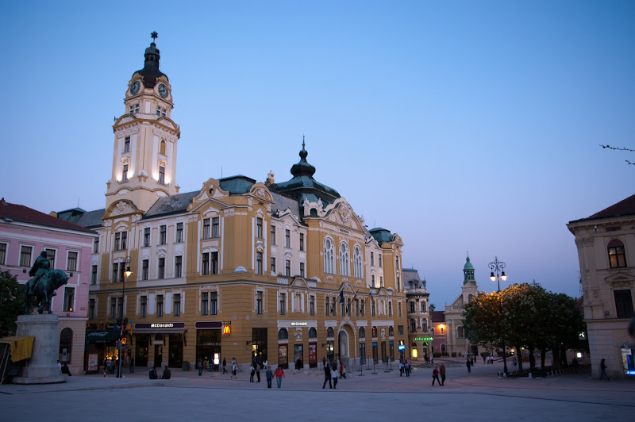
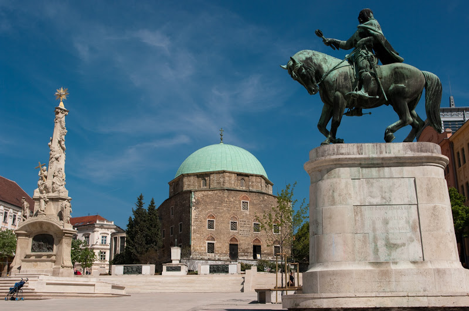
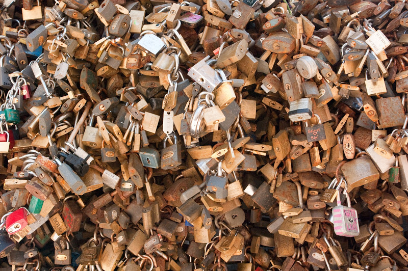

La ville de Pécs (cinq églises en français) est au sud de la Hongrie, à 50km environ de la Croatie et une centaine de la Serbie. Elle est sur la même latitude que Lyon, à un peu plus de 1000km à l'est.

Par rapport aux autres villes hongroises que nous avons visitées, on ressent tout de suite une ambiance méridionale voire méditerranéenne : il y fait plus chaud, il y a de petites places ombragées, les bâtiments sont colorés, les gens plus liants.

  Elle a un petit centre intra-muros avec beaucoup de rues piétonnes dans lesquelles on se retrouve facilement. En revanche, ce n'est par évident d'y rentrer en voiture. Ce centre est très riche en monuments, et pour cause, les différents peuples qui se sont succédés dans le contrôle de la ville ont conservé ce qu'avaient construit les précédents (ou presque). Ainsi, depuis sa création dès le premier millénaire, elle a connu : les Celtes, les Romains (elle s'appelle Sopianae), la principauté de Moravie, Louis le Grand (qui y a fondé une université), les Ottomans (elle compte alors 17 mosquées), les Habsbourg (qui ont eu la bonne idée de transformer la mosquée du pacha Gázi Kászim en église sans la détruire).

Cette richesse culturelle en fait cette année [une des capitales européennes de la culture](http://en.pecs2010.hu). C'est pour l'instant un vaste chantier (ils ont l'air un peu à la bourre), mais elle proposera un programme de concerts, animations, expositions, théâtre, danse, conférences, etc. C'est donc une bonne occasion pour y faire un tour.

La place principale est la [place Szechenyi](http://www.360cities.net/image/szechenyi-istvan-square-pecs) sur laquelle se trouve la fameuse mosquée, avec une colonne de la sainte trinité juste à côté, ainsi qu'une statue de János Hunyadi (Jean Huniade) qui repoussa les turcs jusqu'en Bulgarie à la moitié du XVe siècle. Sur cette place se trouve également l'hôtel de ville et de beaux immeubles bien restaurés.

Dans la rue Janus Pannonius se trouve une curiosité : deux barrières remplies de cadenas. J'ai cru au départ qu'il s'agissait d'œuvres d'art temporaires, mais il apparaît que ce sont des couples qui viennent accrocher un cadenas aux autres pour signifier leur fidélité.

