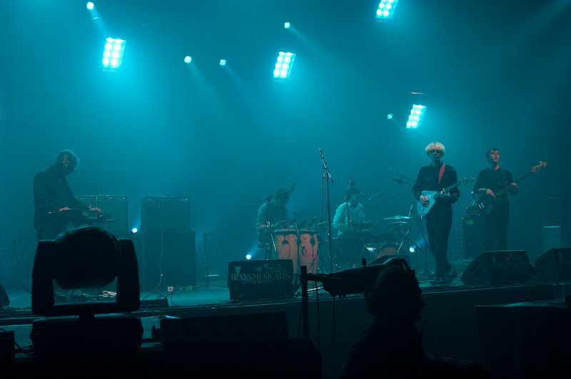
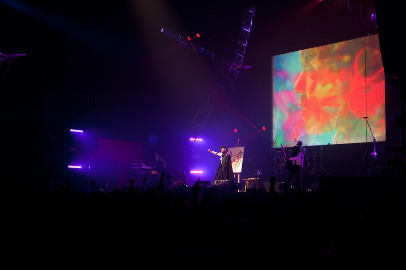

Après avoir récupéré du jeudi soir, mangé les traditionnelles crêpes avec du cidre, direction parc expo en taxi cette fois-ci.

On débute avec Connan Mockasin qui vient de nouvelle zélande. Ils jouent une électro élaborée, simple et psychédélique avec un chanteur à la Andy Warhol. L'ensemble sonne bien, c'était très agréable de commencer par eux.

  Petite bière et direction du grand hall 9, ouvert ce soir, pour l'un des concerts les plus attendus : Janelle Monae. Elle a fait comme prévu son spectacle avec plein d'énergie et de professionnalisme. Il y avait beaucoup de monde sur scène, une petite section cuivre tompette-trombonne, guitares, basse, batterie (le batteur, impressionnant), clavier et elle, très classe en chemise blanche pantalon noir

> en hommage à la classe ouvrière et à l'oppression qu'ils ont eu à subir

nous dit-elle.

Pendant ce temps, nous avons eu des nouvelles de Salem, qui ont laissé une impression désastreuse à toutes les personnes que nous avons vues. Rien raté donc.

Ensuite c'était Matmon Jazz au hall 9. Il mixe et scratch du jazz avec grande dextérité. Un mix très technique (par exemple Take Five, morceau en 5/4 superposé avec un beat binaire) et original (je n'avais jamais entendu de la trompette scratchée). C'est pointu et réussi.

Nous avons voulu aller voir la fin de "Is Tropical" qui jouent une electro-newwave pas très éloignée de New Order et des groupes New-Rave comme Klaxxons, mais grosse déception : ils ont arrêté 15mn avant la fin prévue, peut-être par manque de répertoire. Les gens qui y étaient ont dit que c'était entraînant.

Shogun Kunitori musique psychédélique, électronique et baroque. Des morceaux qui façonnent des mouvements, lents et harmonieux, puis plus rapide et rythmé, le tout parsemé de dissonances électroniques. J'ai trouvé ça plus conceptuel que esthétique comme musique mais c'est intéressant.

Concrete Knives ont fait une belle prestation pour leur première scène de cette taille. Ils ont une nouvelle chanteuse et l'ensemble fait un peu penser à du Cure plus énervé ou du B52's. Je n'ai pu voir que la fin, mais ouest france indique qu'ils ont fait une pop "dansante et intelligente".

Dans une salle bondée, M.I.A a tout écrasé avec sa hip-hop agressive, un peu trop d'ailleurs, je n'ai pas retrouvé les mélodies des 2 premiers albums (Arular et Kala), et le son était désagréable. Comme en plus la salle était un peu trop exiguë pour pouvoir bouger, nous nous sommes rabattus sur le hall 4. Beaucoup plus cool, les 2 DJ (si quelqu'un connaît leur nom, je suis preneur), nous ont joué une musique electronique minimale et intelligente à la Saint Germain. La salle vide au départ, s'est remplie progressivement, avec une très bonne ambiance.

Alex Metric était lancé. Sûrs d'eux, à la limite de trop en faire, mais visiblement contents de jouer leur musique devant le public breton. Une voix percutante et claire, les mélodies restent (comme par exemple [Head Straight](http://www.youtube.com/watch?v=eUuIShXZA3E) ou [It Starts](http://www.youtube.com/watch?v=lRb5Cgy86YM)). Electro pop minimaliste énergique et entraînante. Grosse révélation, même si le chant pourrait être amélioré notamment dans sa justesse.

Nous sommes ensuite rentrés repus de musique et fatigués de ces 2 soirées. Quelques difficultés pour revenir sur Rennes tant il était compliqué de trouver un taxi, découragés par la longue file d'attente pour les bus...
