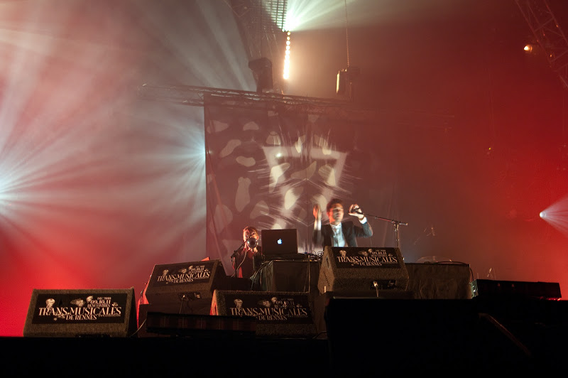
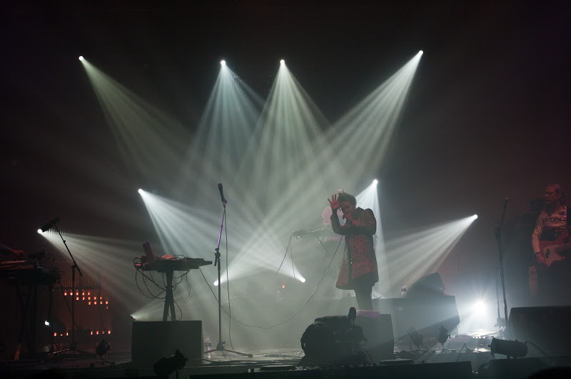
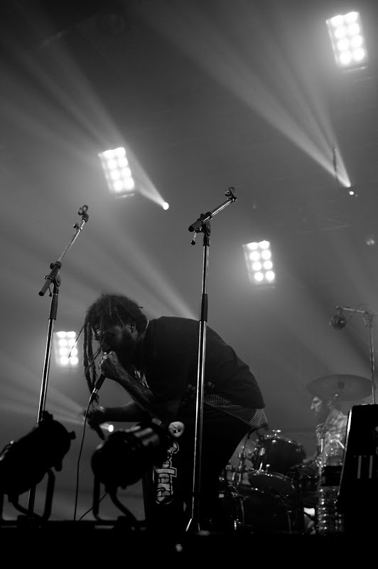

Après les 2 premières soirées, nous sommes allés nous régénérer à coups de grandes bolées d'air, d'iode et de lumière en allant faire un tour en bord de mer. Petit break quasi rituel, pour sortir un peu la tête des soirées et profiter un peu de la région.

Et puis, retour au Parc Expo, vers 21h30. Après avoir fait un tour devant les Crocodiles plus que décevants, et Dominique Young Unique, un rap-hiphop énervé mais un peu trop axé sur la plastique de la chanteuse (à mon avis), direction le hall 9 pour Matthew Dear. Le dandy New Yorkais qui travaille notamment avec Charlotte Gainsbourg, the XX et Hot Chip nous a donné une électro new wave froide mais accrocheuse, entêtante. Il y avait d'ailleurs une ambiance beaucoup plus chaude que la musique devant la scène. Une formations assez variée puisqu'il y avait de temps en temps lui à la voix et aux machines, un guitariste, un batteur. Sur un morceau un trompettiste jouait avec lui, derrière les machines. C'est assez rare de voir ce type de formation.

  Vous pouvez voir Filewile sur [arte live web](http://liveweb.arte.tv/fr/video/Filewile_aux_Transmusicales_de_Rennes/), sur place c'était excellent. Bidouille de sons, musicalement très au point, tous en place, et surtout la chanteuse Oy (Joy Frempong). Fabuleuse. Très juste malgré toutes ses acrobaties, elle est la révélation vocale de ce festival. Un rappeur sud africain était leur invité, il a apporté un peu plus de groove à l'ensemble, et le duo avec Oy fonctionne très bien. Juste un petit regret, ils n'ont pas fait "[On the run](http://www.youtube.com/watch?v=gvgJuMsVsUk)".

Roky Erickson, le rescapé des années psychédélique, avec sa voix toute cassée a fait son come back sur scène. Niveau longévité on respecte forcément. Niveau musique, ça manquait un peu d'énergie. C'était très sombre, assez lent voire poussif, et ça m'a fait penser à du rock pour 3e age : "tu te souviens quand nous allions à nos surprises parties ? Ah ça ne manquait pas d'audace hein!". Je ne suis pas resté jusqu'au bout, mais il paraît qu'ensuite ça a décollé. C'est peut-être comme un vieux diesel, ça demande du temps de chauffe. Big up quand même à lui pour sa performance.

Je ne comptais pas aller voir Pnau, mais nous sommes allés voir la fin, et j'ai trouvé ça intéressant. Electroclash-rock, il y a 2 guitares sur scène, et ça bouge bien. En tout cas la foule est conquise : 

Gonjasufi, le sauvage venu de Californie et qui a concocté son album dans le désert du Nevada dit-on, a fait une prestation beaucoup plus rock que ses morceaux sur le net. Mais toujours bien barré. Du coup pas facile de comprendre, d'autant plus que son chant était souvent approximatif. Je suis passé à côté. En revanche il faut reconnaître que ça ne ressemble à rien d'autre. Son album A sufi and a killer, est très bien, mais il est trop irrégulier sur scène : [son concert au nouveau casino](http://www.dailymotion.com/video/xe1twz_gonjasufi-live-nouveau-casino-2010_music) était apparemment très bien, mais pas celui-ci.

Après s'être reposé un peu nous sommes allés voir Bomba Estéreo l'autre groupe Colombien des trans avec Systema Solar. Sa chanteuse a vraiment une énergie communicative, et se donne à fond, mais voila, sa voix, on ne l'entendait pas très bien, la balance n'était pas bonne. Par ailleurs, je ne sais pas si c'est aussi les filtres sur son micro, mais ça donnait quelque chose de très nasillard et peu audible. Dommage. Sinon le guitariste est toujours autant à fond, en se balançant les yeux fermés, sympa également.

Nous les laissons aussi pour aller fermer les nôtres après ces 3 soirées bien denses.
