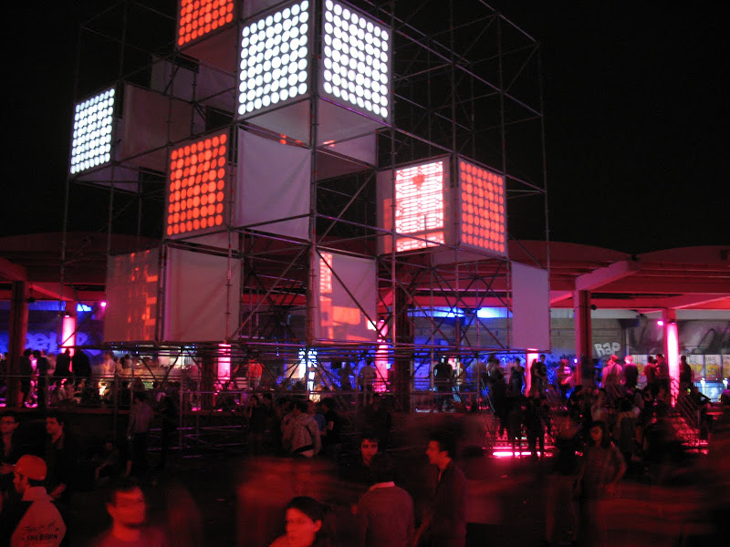
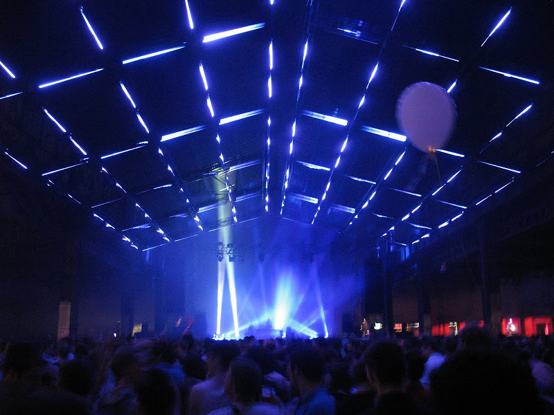

Un petit mot bien loin de l'immédiateté de la blogosphère. C'était déjà il y a 15 jours. A tête reposée, voici ce qui me reste (le pire et le meilleur).

Je n'ai pas pu aller le mercredi soir, c'était trop serré. Je voulais voir DJ Shadow, qui de ce que j'ai eu comme nouvelles n'a pas fait des étincelles.

Jeudi soir, juste après mon arrivée à Lyon, nous sommes passé avec Marc à l'hôtel de ville où il y avait des installations et des ateliers pour les enfants (espace graphitis, batterie , mixes). C'est une des évolutions de cette année, une ouverture vers des plus jeunes. L'équipe des Nuits Sonores est aussi constituée de quarantenaires qui sont parents, ceci explique cela. Et je trouve bien cette ouverture culturelle aux enfants, d'une part car c'est accessible, attirant pour eux, d'autre part c'est un domaine très riche d'expression (graphs, danse, animations vidéo, musique, djing, photo).

Ensuite nous sommes allés au [Modern](http://www.modernartcafe.net/) pour un blind test orchestré par [The Hacker](http://www.myspace.com/thehackergoodlife), et [Richard Bellia](http://www.richardbellia.com/). Bien sûr, la sélection de The Hacker, était très pointue, difficile de trouver un titre, mais l'alternance entre les deux était sympa, avec Richard Bellia qui était manifestement aux anges de passer ses musiques de passionné. Agréable d'entendre des Joy Division, Blur, New Order, [Ralph Meyers and the Jack Herens Band](http://www.myspace.com/ralphmyerz), LCD Soundsystem, Nirvana, etc.

  J'ai retrouvé ensuite Richard Bellia au bar, où j'ai eu droit à un cours de photo façon Rock'n Roll, du genre

> mais de toutes façons tu fais de la merde avec ton numérique, passe à l'argentique

ou encore, "mais non ! Comment tu tiens ton appareil ! Comme ça ! -- en me replaçant vivement les mains -- pour avoir 3 points au lieu de 2". Et a suivi un débat sur le stockage et la pérennité des images argentiques ou numériques. Intéressant, et drôle. C'est agréable de discuter avec des gens qui ont cette bouteille de la scène qui conservent niak et simplicité. Bonne soirée.

Vendredi, première soirée vraiment typiquement nuits-sonoresque, avec la piscine et le marché gare. Je pense que je me répète d'année en année, mais la piscine est toujours un cocktail rafraichissant, fait de bon son, de pas trop de monde, de sélection pointue, de vue sur le Rhône, de coucher de soleil et air libre. Il se trouve que le "All Day Long #2" avec [Dennis Ferrer](http://www.myspace.com/dennisferrer), [The Martinez Brothers](http://www.myspace.com/themartinezbros) et [Argy](http://www.myspace.com/argymusic), n'était vraiment pas à la hauteur de ce que j'ai pu voir là-bas. Toujours la même recette : un morceau qui tourne pendant 5mn, et régulièrement, ils enlèvent les graves et poussent les aigus à saturation pendant 2-3 mesures, ça fait monter les mains des fashionistas, et boum! ils renvoient d'un coup les graves. Et ça marche, le public est ravi à chaque fois. La même chose pour chaque passage entre tracks. Si encore les morceaux étaient bons... Nous croisons [Daniel Victor Snaith](http://en.wikipedia.org/wiki/Caribou_%28musician%29) le leader de Caribou qui était interviewé par Didier Varrod de France Inter. En tong, bermuda tee-shirt, et très sympa.

Ensuite, après un dîner au resto, direction le marché gare. Content de retrouver une fois de plus ce site urbain et industriel, arrangé encore mieux que les autres années. C'est la dernière fois. L'année prochaine, il sera en travaux. Cette année, les cubes lumineux à l'entrée, à l'intérieur donnaient encore plus de relief, j'ai aussi trouvé réussis les plafonds lumineux animés dans les différentes salles.

Le dandy new yorkais [Matthiew Dear](http://www.matthewdear.com/) nous a fait un show nickel, plus cohérent qu'aux transmusicales. Avec trompette, claviers, guitares, basse, batterie, une électro froide, noire comme la new wave, bien orchestrée.

Changement de température pour [Caribou](http://www.myspace.com/cariboumanitoba). Le bidouilleur de sons, et son équipe, regroupés au centre de la scène et se faisant face, ont fait un vrai concert de musique, réellement interprétée, même si une bonne partie des sons provient de machines, ça sent l'humain, ça fait du bien. Le public a le sourire, les chansons sont assez différentes des albums, et le son pas terrible, mais ils sont contents d'être là, de jouer live, et nous aussi.

Ensuite, j'ai un peu décroché, il y avait une salle avec du Rap/Hip hop (on a entrevu [Assassin](http://www.myspace.com/assassinfrance), bien fait, avec des textes genre "tous pourris", et [Ninjasonic](http://www.myspace.com/ninjasonik)). Et dans le grand hall, 3h de mix d'[Agoria](http://www.myspace.com/agoriagoria), avec un public conquis, et pour cause, il est lyonnais, il a été parrainé par Laurent Garnier, il est quasiment résident des nuits sonores. Je trouve cette agitation surfaite. J'ai beaucoup de respect pour ce qu'il fait, c'est un bon DJ, il ne fait pas de playback, les transitions sont carrées, il a apporté également à la musique électro sans faire la star. Mais son set est brutal, sans âme, au départ minimaliste, peut-être trop. Saint Exupéry disait que la perfection c'est quand il n'y a plus rien à retirer, mais voila il manque l'essentiel dans les sets d'Agoria. C'est sans doute subjectif, mais je retrouve des mélodies, des accroches, par exemple dans la minimale de Paul Kalkbrenner (voire Laurent Garnier) que je ne retrouve pas chez Agoria (sauf dans certains de ses titres phares). Ou alors il faut être perché. En revanche, je trouve que d'année en année ses sets sont de plus en plus intéressants.

Le samedi, après un brunch chez Michel, nous sommes passé au Musé d'art contemporain pour voir la scène ouverte à Tokyo. Nous sommes tombés sur [De!nial](http://www.myspace.com/de_nial), sorte de musique electro-punk expérimentale, survitaminée et fluo comme que des japonais peuvent faire. Sorte d'ambiance post-apocalyptique, dont on ne sait pas trop si c'est une ode à la technologie, aux mangas, ou si c'est une critique acerbe de cet urbanisme dense, frénétique et un peu ouf qu'on peut retrouver dans des villes comme Tokyo. Une célébration de la lenteur par l'absurde.

Faute de places pour la soirée All Day Long#3 à la piscine (consacrée au label Ed Banger : entre autres [DSL](http://www.myspace.com/dslbros), [DJ Mehdi](http://www.myspace.com/djmehdi ) et surtout [Busy P](http://www.myspace.com/busyp ) featuring Joey Starr - je crois qu'on a raté quelque chose), nous avons fait un dîner wok-rafistolage-de-barbeuc-tombé-à-l'eau dans notre auberge des monts d'or. Nous sommes directement parti pour la dernière nuit au marché gare.

Là, j'ai enfin pris ma claque, une programmation assez variée, pleine d'inventivité. Nous avons commencé par [Frivolous](http://www.frivolouslive.com/), groupe se revendiquant DIY Electronic, adeptes de "prends ce qui te tombe sous la main et fais de la musique". Très frais, mélodieux, à l'image de ce qu'ils expliquent sur leur site

> music is the encapsulation of not only an emotion, but also a time and place in this world

J'ai acheté direct leur CD en rentrant, qui est aussi intéressant, mais moins que leur live. C'est un bon signe.

La suite était aussi excellente avec ces moments magiques, de découverte hallucinatoire partagée dans la foule, je ne vais pas détailler c'était dense. A vous, si ça vous intéresse, de vous faire une idée : [Reboot](http://www.myspace.com/rebooot), [Shackelton](http://www.shackletonmusic.com/), [Luciano](http://www.myspace.com/luciennluciano), [Joy Orbinson](www.myspace.com/joyorbison), [M.A.N.D.Y.](http://www.myspace.com/getmandy) fabuleuse soirée. Bon ya juste Carole qui s'est foulée la cheville, on dirait pas mais c'est dangereux un festival d'électro ;) C'est tout pour moi, il semble que la dernière soirée piscine All Day Long#4 avec [dOP](http://www.myspace.com/dopdopdop), [Chloé](http://www.dj-chloe.com/), [Château Flight](http://www.myspace.com/chateauflight) était très bien aussi. Bilan, très bons moments, un peu plus quarantenaires (dîners restos, moins de psychotropes...), mais j'ai bien profité des découvertes de cette édition, et des Lyonnais qui m'ont accueilli, merci !
