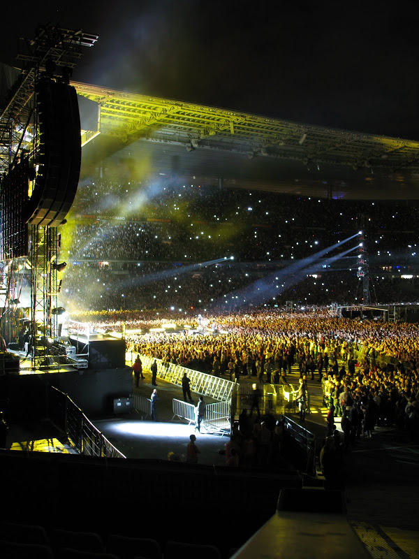

Dixit David Guetta. Eh oui, je suis allé voir les Black Eyed Peas (vous savez, le truc énervant que vous entendez partout "coz tonight's gonna be a good night..."), avec David Guetta en première partie au Stade de France. Ne me demandez pas comment je suis arrivé là-bas ;)

L'ambiance commence dès la gare du nord où je prends le RER pour le stade. Monde de ouf, avec des pousseurs payés par la RATP/SNCF pour que les portes puissent se fermer. J'arrive à 19h là bas, et manifestement tous les gens qui m'entourent vont voir le concert. Des qui marchent vite pour arriver à trouver une place, des qui mangent des sandwich-merguez, des qui boivent des bières, des qui fument des joints, des qui discutent... un quartier entier avec des gens qui vont voir le concert.

Il faut dire que ce sont entre 65 000 et 70 000 personnes pour la soirée, et ça, 3 soirs de suite. Il faut reconnaître un certain rayonnement commercial pour pouvoir rassembler autant de personnes que 3 ou 4 jours de festival de renommée, le tout en un soir... 200 000 personnes en 3 soirs. C'est gigantesque. Je retrouve les potes avec qui j'ai rendez-vous sur la "pelouse or" devant la scène. Le stade est incroyable dans cette configuration. Les gradins ne sont pas encore remplis, mais il y a déjà des gens partout. Les personnes de la "pelouse debout" (le plus à l'arrière), sont entassés derrière les barrières depuis sûrement un certain temps, car leur espace va du milieu du terrain jusqu'au fond. Il y a débauche de matériel, j'ai jamais vu ça. Des grappes d'enceintes devant, sur les côtés, au milieu sur des pylônes, des lumières, une scène énorme. Tout est démesuré. 

Une petite musique de fond un peu "dance" nous distrait pendant que nous buvons quelques bières, et tout d'un coup, BOUM ! Un énorme beat avec basse fait sursauter tout le monde. Ok je vois. C'est un concours de bite, et David a la plus grosse. Il nous explique le concept de la soirée, la plus grosse teuf du monde. Et c'est parti. Du David Guetta, avec un gros son dont la pression fait remuer mon jean. Jamais entendu aussi fort. Pourtant du Mr Oizo aux transmusicales c'est déjà assez fort, mais là c'est encore un autre niveau. J'avais acheté des acouphènes au cas où, yes ! Avec ça c'est déjà un peu plus supportable. Musicalement très pauvre, quelques notes avec des sons toujours identiques. On reconnaît très facilement du DG. Et un public qui saute sur les tubes. Il n'a pas de casque, de toutes manière, il ne mix pas, il enchaîne les tubes. Après écoute sur youtube, ce sont les mêmes.

Après une bonne demi-heure de changement de scène, les BEP entrent, c'est moins fort, le son passe mieux, fait moins "fun radio" (avec les basses et les aigus à fond), peut-être car ils ont un peu plus de choses à exprimer, et ne doivent pas se cacher derrière du son. Leur show est aussi carré que celui de David Guetta et se déroule en 3 parties

Une première partie avec des chansons du groupe. Certaines chansons sont résolument plus hip hop, avec une vraie performance de Will i. am (à confirmer que ce ne soit pas Api de ap). Puis un set de Will i. am (un des membres du groupe), qui reprend du Blur, du Eurythmics, Guns and Roses, Nirvana, Stones, [The White Stripes](http://www.dailymotion.com/video/xm53u_the-white-stripes-seven-nation-army_music) par touches très courtes (10-20 secondes) en alternance manifestement avec du David Guetta. Ce doit être une bande qui passe, car les manipulations (genre je mets un filtre, je l'enlève) n'ont aucun effet sur le son. Pour l'anecdote, c'était assez drôle car à chaque passage de ces groupes connus, les gens se mettaient à sauter partout, et dès que c'était à nouveau un morceau d'électro "à la guetta" la ferveur retombait comme un soufflé. Cette 2e partie s'est terminée par un passage très peace and love, suivie d'ailleurs d'un Bob Marley. Tous les mobiles allumés faisaient office de briquets des années 2000.

Après ce petit quart d'heure américain, 3e partie avec des morceaux du groupe. Animations visuelles un peu à la [Etienne De Crecy](http://www.youtube.com/watch?v=Jzil8S7tUeY) (en 2007 quand même), avec des musiciens à l'intérieur de cubes. Plus tube j'ai l'impression que la première partie (le bouquet final quoi), comme [la reprise de Dick Dale "Miserlou"](http://www.youtube.com/watch?v=ZaI2IlHwmgQ) (si vous savez la chanson de Pulp Fiction avec l'intro à la guitare électrique), ou "[Shut Up](http://www.youtube.com/watch?v=KRzMtlZjXpU)", pour finir sur leurs deux méga tubes [The Time](http://www.youtube.com/watch?v=JwQZQygg3Lk) et bien sûr [I Gotta feeling](http://www.youtube.com/watch?v=uSD4vsh1zDA).

<iframe src="http://player.vimeo.com/video/25617868?title=0&amp;byline=0&amp;portrait=0" width="495" height="278" frameborder="0"></iframe>

A la fin David Guetta vient sauter et lever les bras avec tout le monde. Il nous dit qu'il nous aime, qu'il aime Cathy (sa femme), Elvis (son fils), et les BEP, car ils nous ont offert un hymne universel, apprécié dans le monde entier et même par les martiens (j'imagine que c'est de l'humour, mais j'en suis pas totalement certain).

Bon ok, il y avait des bons musiciens, le show est millimétré, et justement. C'est tellement cadré que les gens devant sont aussi dans leur cadre. Ils sont avec leur famille, leurs potes, et restent entre eux. Ils sautent quand cela leur est suggéré, puis s'arrêtent. Ils ne bougent pas de leur place même debout, il y a des sacs part-terre et c'est difficile de se déplacer. Je pouvais même prendre des notes sur mon mobile sans être bousculé. Rien à voir avec des festivals où ça brasse dans tous les sens. Il ne faut pas rester dans les escaliers pour des raisons de sécurité et il ne faut même pas dépasser une ligne jaune en bas de la pelouse.

Bref, en fait de plus grosse teuf du monde, c'est plutôt une teuf clinique commerciale, où la liberté (ou le sentiment de liberté) qui est l'un des moteurs de la fête n'est pas vraiment au rendez-vous. J'ai l'impression de venir voir une fête, cette de David Guetta, pas de faire la fête, de faire mien ce moment. Idem pour le partage et l'échange entre les gens, ils viennent consommer du spectacle, on leur fournit du zapping de tubes, avec une installation à la pointe. Sorte d'individualisme consumériste caressé dans le sens du poil. C'est dommage que cet appareil ne soit pas utilisé pour faire la promotion d'autre chose que du David Guetta (par exemple entre les 2 shows). Une ouverture "culturelle" osons le mot, pour éveiller un tout petit peu cette masse endormie à coup de tubes planétaires, et radios formatées.

Le show fini (après 2h de BEP), faut pas déconner trop non plus, lumière, et tout le monde trace vers le RER, dans une bonne ambiance. Il est 11h45, sacré fête. Merci Paco pour cette expérience, ce n'est pas ironique. La prochaine fois, ce sera mon tour de t'emmener voir euh faire la fête ;)
