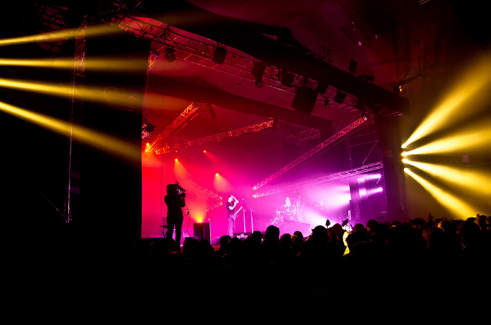
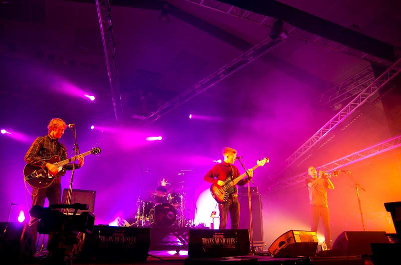

Quelques notes pour souvenir des 33e Transmusicales.

10e année qu'on s'y retrouve entre potes. La première était l'année des Bauchklang, Royksopp, Zero 7,... en 2001. C'était au Liberté, et on déambulait dans les rues entre les différentes salles du festival. C'était même avant le réchauffement climatique car on se gelait grave.

Cette fois, pas pu arriver jeudi, mais Marc et Michel y étaient, et ont été déçus, comme Ouest-France (je ne sais pas si l'un et l'autre de ces canaux sont des références en la matière mais faute de mieux). En rentrant « samedi » soir, on a entendu Magnifico (qui passaient jeudi soir) dans la voiture sur le Mouv', sorte de Shantel sous exta. Ils m'ont quand même précisé que ce concert avait été bien en place et entraînant comme Zum Zum :

<iframe src="http://www.youtube.com/embed/O9y3EhQ0FSw" frameborder="0" width="480" height="360"></iframe>

Vendredi soir, tout de suite en arrivant, on fonce au parc pour commencer par [Robin Foster](http://www.youtube.com/watch?v=sw5iop3E-Wc), de la bonne pop mélodieuse. Un peu du néo-U2 de meilleure qualité musicale, avec le chanteur d'Archive : Dave Pen. Le duo est bon. Il avait aussi été présenté par Didier Varrod sur France Inter. Bonne idée cadeau pour les fêtes. C'est juste un peu lent pour commencer le festival. On bouge.

Nous sommes passé voir [Orchestra of Spheres](http://www.myspace.com/orchestraofspheres), qui était [un des repérages](http://blog.lestrans.com/les-pronostics-des-pros/les-pronostics-de-%E2%80%A6-jean-luc-marre-pias/) qu'avait fait Pias. Joyeuse cacophonie teintée d'afro, un peu trop bordélique pour nous.

Ensuite, [Hollie Cook](http://www.holliecook.com/), scène 9, reggae, pas neuf non plus, mais très entraînant, elle a une voix magnifique, des musiciens enthousiastes. Pour la petite histoire c'est la fille du batteur des Sex Pistols (Paul Cook) et de la chanteuse de The Belle Stars (Jennie Matthias). Ils ont donné le sourire au hall 9. Vous avez leur concert sur [arte live web](http://liveweb.arte.tv/fr/video/Hollie_Cook_aux_Trans_Musicales_de_Rennes/).

[Todd Terje](http://www.myspace.com/toddterjemusic) a enchaîné avec un mix électro-house-disco original et sex. Une découverte de ces trans en ce qui me concerne.

[SBTRKT](http://www.myspace.com/subtractone) (prononcez subtrack) a enchaîné avec la voix de velours de son chanteur, et son électro dubstep pleine de graves et de nappes synthétiques aux accords jazzy. Ils m'ont bien emmené où ils voulaient. Les chansons avec les "guests" (absents) de leur album étaient moins dynamiques que dans l'album (par exemple [Pharahos](http://www.youtube.com/watch?v=ErYAGQZs8e0)). Pas tous : par exemple la version qu'il ont joué de [Wildfire](http://www.youtube.com/watch?v=ZdUINbi4wSY) (avec Yukimi Nagano la chanteuse de Little Dragon) était bien entraînante alors qu'elle est assez lente.

Motor city drum ensemble, plus dark, plus deep house, bien aussi. Très bon vendredi, on a juste raté "Stuck in the sound" qui ont fait un concert énergique de ce que j'ai pu lire. Les trans partaient bien.

Lendemain on a débuté par le petit phénomène des trans 2011. C'est [Carbon Airways](http://www.youtube.com/watch?v=_bPJ_Pzo1YM) : Éléonore et son frère Enguérand, respectivement 15 et 14 ans, étonnants de maturité musicale. Une musique sombre faite de mélopées électro graves et abrasives, contrastant avec leurs voix encore juvéniles coupantes comme du cristal écrasé. Le tout rythmé par des beats puissants façon dernière vague électro (justice, digitalism, Birdy Nam Nam...). Ils ont fait un concert spontané, juste. Ils étaient contents d'être là et nous aussi.

Ensuite [Hanni El Khatib](http://www.myspace.com/hannielkhatib), rock décapant minimal avec juste guitare batterie. Carré, varié (pas mal de petites séquences de 1 ou 2 mn qui s'enchainent), très fort, mais il n'y a pas eu l'étincelle. Pour l'anecdote, on s'est amusé à observer le public qui était plus âgé que la moyenne. On s'est dit que le rock parlait moins aux nouvelles générations.

Puis [Nguzunguzu](http://soundcloud.com/nguzunguzu) [répérage aussi de pias](http://blog.lestrans.com/les-pronostics-des-pros/les-pronostics-de-%E2%80%A6-jean-luc-marre-pias/). Agoria, avec son beat lourd, les breaks de relance réguliers et l'absence de matière mélodique. Le démarrage du set était très bien fait avec un remix de "Pump it up" (Marrs) mais j'ai ensuite rapidement décroché.

[Janice Graham Band](http://janicegrahamband.com/), sortes de Clash Ska-Ragga, avec un chanteur bassiste qui a l'air d'avoir 12 ans mais qui assure grave, une guitare, une trompette et une batterie. Bien fait mais pas eu le déclic non plus.

Holloys, leur originalité est d'avoir un chanteur trompétiste, deux basses, deux batteries, mais le tout est très approximatif. Du coup on est rentré.

Je suis passé à côté samedi au niveau programmation. Et puis j'ai trouvé l'accès aux salles pas aisé par rapport aux autres années : je me suis retrouvé bloqué devant le hall 9 et hall 3 plusieurs fois, le hall 4 avait également un sens de circulation (de temps en temps). L'accès au hall 9 par seulement 2 entrées pas pratique non plus.

J'ai l'impression que cette année, plus de choses se passaient ailleurs qu'au Parc Expo. J'aurais bien vu Haight Ashbury, Kutu folk records, la soirée hip-hop à la Cité. Ce n'est pas une mauvaise chose, mais ça va changer la manière de faire le festival.

Sinon, la fréquentation était bonne puisqu'ils ont eu 50000 spectateurs (billets), l'année dernière c'était 52000 et avant 42000 (source Ouest-France). On aime toujours autant aller aux Transmusicales, les bretons, les découvertes, le son. Merci encore, c'est une sacré machine à faire tourner tous les ans. Mais cette année a été une petite édition de mon petit point de vue.
