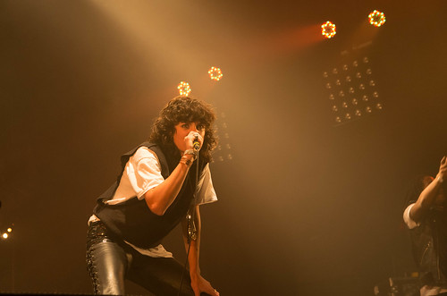

Autant le dire tout de suite, notre programme ambitieux n'a pas été tenu. Plutôt que d'énumérer les concerts manqués, on peut parler de ceux dont on a entendu du bien. C'est le cas de [Lianne La Havas](http://www.liannelahavas.com/) qui a envouté tout le monde, ou encore du jeune britannique [Paul Thomas Saunders](http://paulthomassaunders.com/) qui a déjà une sacré maturité dans ses chansons et sa voix.

Au parc expo ou la soirée est bondée (13000 personnes selon Ouest France), nous avons commencé par l'électro-pop sucrée et mélancolique (ce qui se dit chill wave paraît-il) des New-Yorkais [MSMR](http://msmrsounds.com). Les 2 claviers et la batterie sont bien calés, la chanteuse avait un peu de mal à être juste surtout au début. Comme les sucreries, c'est très agréable, mais faut pas trop en abuser sinon on peut avoir des crampes d'estomac.

Puis direction le grand Hall 9 qui est ouvert ce soir. Toujours aussi bien. Sobrement et efficacement éclairé, avec une bonne acoustique surtout quand il est plein. Vers 23h, c'était la grande formation musicale du Zoom Project de Rachid Taha qui jouait. une bonne douzaine de très bons musiciens, malheureusement, Rachid Taha, même s'il a toujours cette voix aussi touchante et entêtante dans les aigus, était un peu à côté de la plaque.

Nous nous sommes rabattus sur la déjantée [Phoebbe Jean and The Air Force](http://phoebejeanandtheairforce.fr/). La chanteuse constitue déjà un spectacle, mais elle a aussi des choses à dire et à chanter. Deux danseurs sont avec elle sur certains morceaux car sinon il n'y a pas grand monde sur scène. Tout repose sur elle. Jolie voix à fleur de peau, entre ingénuité à la Stina Nordenstam, et l'autorité de Sinead O'Conor, elle est pas toujours juste mais ça passe, ça fait partie de son interprétation d'équilibriste.

Retour à la grande scène, nous avons frisé l'émeute pour rentrer voir [Vitalic](http://vitalic.org/) à 1h15 au hall 9. Après avoir passé une demi-heure de compression, mouvement de foules, baptêmes au r... sodas énergisants et bières, on déboule dans ce déluge de son et de lumières stroboscopiques. Les nappes sonores sont toujours un peu les mêmes. C'est plus varié que lorsqu'on l'avait vu pour son fameux tube LA-Rock où il enchaînait des samples tous les quarts d'heures, seul derrière son pupitre. Là, il est accompagné d'un batteur et d'un clavier et le show est dynamique. Bondissant et communicatif, la débauche d'énergie sonore et lumineuse emmène le hall dans une transe numérique frénétique. Personnellement, j'ai pas gobé. Je trouve ça pusillanime, formaté et racoleur. Mais c'est peut-être ce type de musique sur-vitaliquée comme celle de Madeon qui accompagne le monde cyber-punk.

Contraste saisissant avec celui qui succède à Vitalic. Le hall s'est complètement vidé, il est au devant de la scène j'aurais même cru que c'était un DJ de transition s'il n'avait pas mis sont tube Turkish Pepper : c'est le scandinave [Blackbelk Andersen](http://soundcloud.com/blackbelt). Deep house assez lente, certains des anciens spectateurs de vitalic gueulaient leur frustration au premier rang à quelques mètres du DJ qui demeurait stoïque et décontracté. Il a même fini son set avec une clope et une cannette de bière. Mais c'est vrai qu'à la suite de Vitalic, tout élaboré qu'il puisse l'être, son set manquait de souffle.

Pendant ce temps, [Agent Side Gringer](http://www.agentsidegrinder.com), eux, étaient à fond dans leur rôle : celui du côté sombre et froid de la force. Une pop industrielle, dont les percussions de batterie sonnent comme des barre de métal tombant sur le sol d'une usine désaffectée. Le chanteur, menaçant et dégingandé dans son ample chemise blanche colle à la musique avec sa voix froide et rebelle. C'est effectivement très Front242 ou Joy Division mais sans être réchauffé. Ils sont généreux et ils jouent bien.

Vite, il faut aller aussi voir un autre phénomène, c'est [Birth Of Joy](http://www.birthofjoy.com). Rock énergique qui fait penser tout de suite aux Doors. A l'écoute de l'album, un peu comme nirvana, on se demande si la voix du chanteur peut tenir tout le concert, et si le côté grunge peut devenir prétexte à des concerts approximatifs. Négatif. Ils sont justes et pros, la voix du chanteur tiens aussi toute ses promesses. Par ailleurs le chanteur assure aussi très bien la guitare électrique. Un groupe à suivre.

Les français [Sarah W\_Papsun](http://www.papsun.com) nous font découvrir encore un autre style musical qu'on ne connaissait pas. "rencontre entre le math-rock au cœur tendre, la pop qui se creuse la tête et l'electro futuriste" qu'ils disent sur le descriptif des trans. C'est pas faux. Electro-pop très carrée, avec un chanteur qui remonte un peu la température des synthés par une voix à la Daemon Albarn, ou encore les Foals. Ça fonctionne bien, on se laisse emmener sans problème.

Et puis on a fini un peu comme on avait commencé, avec [Jupiter](http://www.wearejupiter.com) un DJ set acidulé, très frais pour se dégourdir les jambes en fin de nuit. Le set s'est terminé avec une tuerie qui a été coupée un peu vite. Avec ma voisine, on s'est regardé, un peu déçus du _coitus interruptus_.

Edit le 10 déc : photos et quelques corrections.
