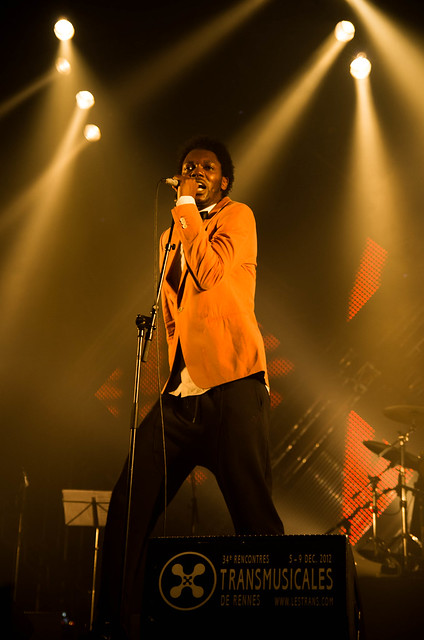

Réveil, galette, bolée, et Liberté. A l'étage. La salle est pleine pour venir voir le jeune groupe rennais [Alphabet](https://soundcloud.com/alphabetmusic). J'ai déjà pas mal écouté leurs titres sur soundcloud avant de venir, ils ont 6 morceaux avec de très belles mélodies qui me rappelle les harmonies de Ultra Vivid Scene (la chanson "Animals" par exemple). Ils sont 4 sur scène dans une formation classique basse, batterie, clavier. Le chanteur fait guitare et clavier. Ils attaquent par un chant polyphonique sur un bourdon. Et puis ça démarre. Oscillant entre rock et électro, ils ont déjà une bonne assurance sur scène. Même s'ils cherchent encore leur son (ils ont par exemple republié Animals dans une version beaucoup plus rock que la première), ils ont su forger le caractère du groupe. Ils savent mettre le public dans leur atmosphère, comme cette audace du "silence est d'or" où ils ont fait silence pendant 1 minute. Quand ils reprennent, le public est réceptif. On leur souhaite de continuer.

Le temps d'écrire ensuite l'article du vendredi soir et de se restaurer, on a juste le temps de retourner au parc expo et d'apercevoir la fin de [Mélody's Echo Chamber](http://melosechochamber.tumblr.com), un des repérages de Didier Varrod. On se retrouve dans un halo de saturation psychédélique, avec la voix aérienne et d'une grande justesse de Melody Brochet. On est très vite transporté dans leur chambre d'écho multicolore et on s'y sent bien.

Hall 9 pour le retour de [Blackstrobe](http://www.blackstroberecords.com/). Déjà 10 ans depuis leur tube "Madonna" is in love with me. Depuis, Yvan Smagghe est parti vers d'autres projets. Rétrospectivement, on se dit que c'était une bonne chose. Rythmique tirée au cordeau, beat bien lourd, la première partie est plutôt électro et la seconde rock'n roll. Certains riffs de guitare évoquent du ZZ Top. Le groupe réconcilie toutes les générations et a met le feu au hall 9.

Les 2 DJ's de [TNGHT (tonight)](http://www.warp.net/records/tnght/) amènent le tonnerre avec des beats secs comme la foudre et des basses écrasantes qui font vibrer tout le hall 9. Parfois des samples de rap sont ajoutés à cette électro froide et ravageuse. Le système audio tourne à plein régime, les line arrays (les grappes d'enceintes) sont à fond. Ça m'évoque vaguement du 2 many DJ's en plus bourrin. Pas assez perché et manque de bouchons pour m'y sentir bien, le tout est assez inégal.

Il aurait fallu une pièce plus grande que la green room pour le DJ set de [Get A Room](http://smalltimecuts.com). Pas pu rentrer, il y avait trop de monde. Du coup on va voir [Hot Panda](http://hotpanda.ca), Un groupe canadien avec une bassiste qui déchire, un chanteur avec une voix haut perché. Ils jouent une pop ingénieuse et décomplexée, et on s'amuse avec eux.

On continue de se réchauffer en allant au hall 4 voir [Baloji](http://www.baloji.com/) et ses orchestre des Katuba et [Odemba All stars](http://www.africaoye.com/tandt/odemba_.html). Grande formation avec des cuivres (saxo ténor, trombone). Le guitariste et le clavier sont assis, certains membres sont des vétérans mais qu'est-ce qu'ils jouent bien! Le bassiste avec sa basse à 5 cordes est incroyable, cette fluidité nonchalante qui fait croire que c'est facile, le guitariste qui fait des riffs à la James Brown, tout est très en place.

C'est de l'afro funk rock. Le chanteur, qui rap aussi parfois, virevolte sur scène et nous fait voir pourquoi on dit "jouer de la musique". Peut-être aussi pour oublier un peu les drames qu'ils vivent au Congo : il nous rappelle que chez lui et dans les pays environnants, les luttes de chefs pou un clan finissent en guerres civiles. Indignation !! Nous dit-il. Fierté de leur culture aussi, il nous le précise : "ceci n'est pas de la world music, c'est de la musique de chez nous".

Entre temps on est passé voir des bouts de sets de [Compuphonic](http://soundcloud.com/compuphonic-1) (house) et [Kölsh]( http://www.facebook.com/kolschofficial) (minimale) dans la green room. Espace et son trop restreints. Et puis cette moquette est une fausse bonne idée pour faire "cosy". Avec les boissons renversées, on a les pieds qui restent collés sur le sol poisseux. On a l'impression de se retrouver au sous-sol de feu le "triplex" à Grenoble ou comme me disait ma voisine, à l'"étincelle de la Bienne" à Jeurre dans le Jura. Décidément, en plus de son côté commercial, j'ai du mal avec cette pièce. En revanche l'ambiance est bonne et on a rencontré entre autres un fan de minimale.

Pour mémoire et pour les intéressés, je note en vrac des groupes qu'il m'a cité : Solonum, N'to, Worakls, Frederico Milani, Andhim, Super Flu, Pleasure Kraft, Format b.

On a terminé par le show attendu de [Skip & Die]( http://skipndie.withtank.com). Une rencontre entre l'extravagante Catarina Pirata et le producteur néerlandais Crypto Jori. Ils ont monté un projet de road trip sonore avec des collaborations locales en Afrique de sud. On pense de suite à M.I.A ou encore Santigold même s'ils trouvent cette comparaison simpliste.

C'est vrai que leurs pérégrinations ont donné lieu à une certaine variété de styles, életro-ethnique, reggaetón. La formation sur scène est originale : outre clavier, guitare, il y a deux grosses sections de percussion ; la cithare saturée et sa voix montant facilement dans les aigus nous amènent presque jusqu'en inde comme par exemple dans Jungle Riot. L'ensemble est énergique, et arrive malgré les 5h du matin à soulever la foule du hall 4 qui affiche complet.

Il est alors 5h25, pas la peine d'aller voir [Spitzer](http://www.spitzer.fr) pour 5mn, et pas le courage de prolonger pour le dernier concert [Cuir! Moustache]( http://www.facebook.com/cuirofficial). Retour à Rennes-centre.
