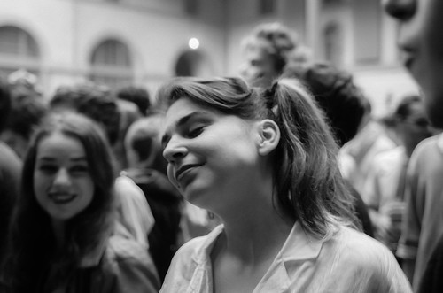
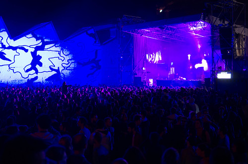

**Jeudi - _Smooth Loose_**

Je n'ai pas pu arriver avant le jeudi. En arrivant de mon premier covoiturage, depuis Sarlat, je vais faire un tour aux subs, petite nostalgie de l'édition 2007 dont j'ai un très bon souvenir d'abord pour l'esthétique du lieu, et puis pour la prog : [Apparat](http://www.apparat.net/), [Sebastian](http://www.myspace.com/0sebastian0), [Tiefschwarz](https://soundcloud.com/tiefschwarz-1), [James Holden](http://www.jamesholden.org/), [Joakim](https://soundcloud.com/joakimbouaziz)... Je ne sais pas si c'est le syndrome vieux-con mais je me demande si la prog n'était pas plus riche à cette époque où le festival devait faire ses preuves... pour l'heure, grosse déception : NS days aux subs ça tape comme à 4 du mat (par ex [Ryan Cronson](http://www.myspace.com/ryancrosson), [Seth Troxler](https://soundcloud.com/sethtroxler)), mais il fait jour, on n'est pas "dans l'ambiance". Je regarde avec un mélange d'incompréhension et d'envie les gens qui transent, seuls dans leurs trips.

Petit détour au Modern, avant de ne pas arriver à rentrer à la plateforme pour la nuit Kompakt (j'aurais bien revu [Kölsch](http://www.youtube.com/watch?v=cRKhrD-MuW4)), car c'était blindé. #fail, mais heureux quand même de retrouver les lyonnais et l'ambiance des nuits.

**Vendredi - Psychédélique-House**

Toujours pas accroché aux subs, on est plusieurs à regretter les petites montées de la piscine du Rhône, le coucher de soleil, la bonne prog d'introduction pour la suite. Sans doute aussi le sentiment du _happy few_. Du coup on va tôt aux usines Brossette pour un [Connan Mockasin](https://soundcloud.com/connanmockasin) toujours aérien, onirique. Ils sont très justes et bien carrés avec l'effet chorus prépondérant de la guitare du chanteur Connan Hosford tout le long du concert. J'ai l'impression qu'ils ont progressé sur scéne depuis leur concert aux transmusicales il y a 2 ans. Le son de la scène 3 en extérieur (merci il ne pleut pas) est très bon.

Nous avons raté Mélody's Echo Chamber qui passait juste avant, mais nous l'avions vu [aux Transmusicales en décembre](http://liveweb.arte.tv/fr/video/Melody_s_Echo_Chamber_Trans_Musicales_Rennes/). Avec Dan Deacon qui suivait Connan Mockasin et sa musique psychédélique survitaminée à l'électronique bien crade-house, sorte d'Animal collective en plus déjanté, la scène 3 était résolument psyché.

Pendant ce temps, sur la Scène 1 c'était le "future sound of UK". Avec [Disclosure](https://soundcloud.com/disclosuremusic) : de la vraie house de gay pride. Qu'on ne se méprenne pas avec ces temps de mariage pour tous c'est une qualité : festive, efféminée et mélodieuse. Bonne ambiance, très dense, impossible de retrouver les autres après un détour par les commodités. Suit Jamie Smith (aka [JamieXX](http://www.jamiexx.com/)), le producteur, beat machine du groupe XX. Il est dans la veine du groupe : downtempo et musical. Ses transitions sont inexistantes, le tout un peu décousu, mais il a une bonne selection de titres et il est au vinyl.

A la Scène 2, nous avons vu [Theo de Montgeri](http://www.myspace.com/theodemontgeri) : il était dans la thématique de la soiréee : faite de nappes sonores et de house. La sienne était deep et minimale. Et puis [Fritz Kalkbrenner](http://www.fritzkalkbrenner.de/). La classe berlinoise. La première grosse claque du festival. Il reprend le côté travaillé des sons de son frère, en étant moins minimaliste : il ajoute de la matière mélodieuse, avec sa voix par exemple. Il termine son set avec tout le public qui entonne "[Get A Life](http://www.youtube.com/watch?v=UCJZSI5Iuo4)".

**Samedi - Foule's garden**

Nous avons zappé cette fois-ci les NS Days aux sub, apparamment l'ambiance a toujours autant de mal à décoller malgré un bon set de [Squeaky Lobster](https://soundcloud.com/squeaky-lobster) :

<blockquote class="twitter-tweet">On va arreter de se mentir : malgre l'impassibilite ambiante, le set de Squeaky est l'un des plus enthousiasmants de cette edition <a href="https://twitter.com/search/%23ns2013">#ns2013</a>

— LE PETIT BULLETIN (@PETITBULLETIN) <a href="https://twitter.com/PETITBULLETIN/status/333273231291187201">May 11, 2013</a></blockquote>

Pour le reste, les Raveonnettes ont remplis la scène 1, et le set de vitalic était décevant. Pas trop de regrets.

On est arrivés pour [Pantha du Prince](http://www.panthaduprince.com/) scène 1. Gros enthousiasme du public, pour un groupe qui fait vraiment de la musique "nan mais tu as vu c'est trop ouf ce qu'ils font". Live très vivant qui compense une certaine monotonie de l'album (écoutez Elements of light du début à la fin). Très bon son bien sec de la rythmique et des samples qui contrastent avec les raisonnances des cloches. Ovation.

<blockquote class="twitter-tweet">
On le soupçonnait, c'est avéré : la minimale carillonnante de Pantha et son lab est l'une des plus belles choses qu'on ait entendu <a href="https://twitter.com/search/%23ns2013">#ns2013</a>
— LE PETIT BULLETIN (@PETITBULLETIN) <a href="https://twitter.com/PETITBULLETIN/status/333332588167049217">May 11, 2013</a></blockquote>

Et puis [Prins Thomas](https://soundcloud.com/prinsthomas) en house sur la même scène. Son fait de nappes de sonorités synthétiques des années 80 à la Gorgio Moroder. Sympa mais rien de neuf dans ce set. On reste sur cette scène pour [Todd Terje](https://soundcloud.com/toddterje) v.s. [Lindstrøm](https://soundcloud.com/feedelity). Grosse attente (de ma part en tout cas), mais assez rapidement déçu ; (encore) des nappes synthétiques, un peu chiantes à longue. Comme disait Michel, ils sont mieux en célibataire. On se fait notre 2e bain de foule après Fritz Kalkbrenner : difficile de bouger même sur place pour danser. C'est limite désagréable comme compression. Mais il y a un _twist_ : Lindstrøm intercalle le fabuleux I feel space de l'album It's a fidelity affair :

\[soundcloud url="http://api.soundcloud.com/tracks/17089608" params="" width=" 100%" height="166" iframe="true" /\]

et ça repart dans les nappes, on s'en va direction scène 2 et puis... 2e _twist_ remix de Brian ferry "[dont stop the dance](http://www.youtube.com/watch?v=XjhTHQhJLxs)", génial. Enchainement avec le tube de Todd Terje (Inspector Norse) :

\[soundcloud url="http://api.soundcloud.com/playlists/1508575" params="" width=" 100%" height="166" iframe="true" /\] Fin en beauté pour un set un peu mou du genou avec en prime un hommage à Whitney Houston suivi de bon anniv' version electro pour Todd. Bien bien finalement.

Petit détour par la scène 3 extérieure, [Jack green](https://soundcloud.com/jacquesgreene), minimal, hypnotique à écouter, il est 2h, et le festival est plein :

Nous passons scène 2, la scène des invités du génial Daniel Snaith, le touche à tout de Caribou. On débute par Dj harvey : house puissante, avec un clin d'oeil à Laurent Garnier avec Crispy Bacon. C'est Daniel Snaith _himself_ (aka Daphni) qui continue. C'est assez semblable au style de son mix de l'année dernière au même endroit. Hyper éclectique avec de la soul dedans un peu foutraque et entrainant.

Enfin, après avoir écouté [Rone](https://soundcloud.com/rone-music) sur deezer l'après midi, j'avais envie de finir en souplesse. Ce sont effectivement des melopées sonores, la scène 1 est blindée malgré les 4hr46 et 5 jours de fête. C'est l'heure de la dernière clope. Son mix est propre. Ce sont ses morceaux. Toujours un peu le même schéma : sur le contre-temps en fin de mesure, on comprend assez vite. Pas grand chose de mieux que son album. C'est à écouter plus que voir en live : tout l'inverse de la Pantha du Prince. Malgré le manque d'énergie de son mix, je pense acheter son 2e album Tohu Bohu. Carole me précise que pour son 1er album il s'est inspiré du roman de fantasy "Les hordes de contrevent".

C'est fini. Il est 5h on commence à se dépècher pour rentrer dans un tromé. C'était une bonne édition des Nuits, très house sur le vendredi et samedi, alors que le mercredi était plus tech'. J'ai une nouvelle fois préféré le vendredi, plus festif et sympa, avec moins de teufeurs de boite de nuit speedés du samedi. Encore des choses à réécouter, acheter, découvrir : Fritz Kalkbrenner, Pantha du Prince, Jack Green, Disclosure, Rone... Et hâte de retrouver cette ambiance...

PS : en lisant ce soir à ma fille la chèvre de monsieur Seguin, j'ai ressenti de l'émotion. Je pensais à la résistance, à la subversion aux aléas de la liberté. C'était la première fois, je crois, que je relisais ce texte depuis l'avoir entendu il y a...longtemps. Toujours dans l'émotion, je fumais une garo sur le balcon en regardant les allées et venues des voitures sur l'avenue Jean Jaurès avec les feuillages vert clair et printaniers des arbres, j'ai eu l'impression de voir cette scène pour la première fois. Vieux con, cela doit vouloir dire avoir l'habitude. Peut-être si je trouve moins riche les dernières éditions des nuits sonores, ou des transmusicales, c'est que j'en ai trop l'habitude. Pire que le festival en lui-même, c'est peut-être l'habitude de la découverte qui me guette. Comment faire autrement ? Comment toujours s'étonner ?

PPS : merci à [Arty Farty](http://www.arty-farty.eu/en/) pour l'organisation de ces Nuits, merci aux Lyonnais qui m'ont accueilli, merci à Carole pour ses références et son aide à mes notes, Michel pour ses portraits.
