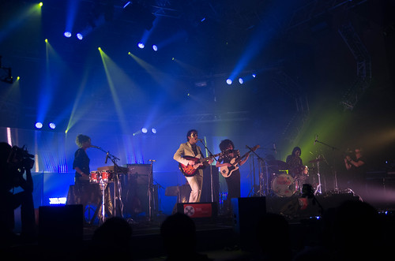

Je crois que je le précise tous les ans, mais le jeudi au Parc expo c'est pépère : pas trop de monde, une programmation qui finit tôt, et cette année, elle était en plus assez tranquille (à part La Yegros et la Green Room).

Après notre retard pour sanglier écrasé, on est arrivé de justesse pour les 2 dernières chansons de [Moodoid](http://entreprise.bandcamp.com/album/moodoid-ep). Sur scène 3 filles (clavier basse batterie) et Pablo Padovani voix et guitare. Nous avons su qu'ils avaient commencé timidement et s'étaient lâchés progressivement. Ça tourne bien pour un de leur premiers concerts, certains changements de rythmes de "[Je sais qui tu es](http://www.youtube.com/watch?v=VczahVkJMkI)" sont moins fluides que sur l'EP. Leur son est plus plein que dans l'enregistrement, mais ils nous emmènent dans leur monde psychédélique et noisy. Je ne connaissais pas l'avant-dernière chanson très harmonieuse : on attend avec impatience leur album en janvier pour découvrir ces nouveaux titres.

  Je retrouve ensuite les autres qui sont devant London grammar : ils jouent devant un hall 4 plein. Ils sont contents d'être là : ils expliquent que c'est leur plus gros concert. Ils jouent bien avec de petites différences de lignes vocales. Petit concert de 40mn, bien fait, mais on s'endort un peu.

On sort de notre torpeur pour aller voir Luke Jenner dans l'autre hall : ils débutent devant un hall vide (london grammar n'a pas tout à fait terminé). L'ancien chanteur de Rapture est tantôt a la basse tantôt au clavier avec un autre bassiste/clavieriste et batterie. Mais surtout il chante. Très juste, très expressif il me fait penser parfois à Ian McCulloch (chanteur de Echo and The Bunnymen) avec plus de maîtrise. Les 2 autres musiciens chantent aussi. Duo, trio, avec un rock minimal très mélodieux. Bonne ambiance, la mayonnaise prend. Et il y a la fin. Je ne sais pas trop qu'en dire. Le batteur se met au clavier/voix et Luke Jenner à la batterie ils "jouent" [Jump](http://www.youtube.com/watch?v=wlq0lYB3iSM) de Van Halen. Soit c'est de la déconne, mais le gars au clavier n'avait pas l'air de trop rigoler, soit c'est un gros plat.

On passe par une green room énorme : la petite scène dans un stand est devenue une vraie scène. Popa zens joue une house [très deep et minimale](https://soundcloud.com/djslimpopazens/nxdkud8vrxut) (ou alors c'est la balance qui fait un peu trop dans les graves). Pas en état de partir là dedans, je vais voir Bosco Delrey : rock'n roll basse guitare batterie. Chant a la Iggy Pop avec de bons musiciens ils font un rock abrasif, épuré et sombre.

Molotov Jukebox aurait du réveiller la soirée, ils ont annulé, c'est Sixtine qui a remplacé. Genre électro avec chanteuse et violoniste. Elle joue sur un violon électronique blanc avec de la saturation, c'est assez inhabituel. On retrouve aussi une part de musique classique avec un morceau connu (dont je ne retrouve plus le nom) commencé au piano et décliné en électro. De temps en temps ça prend, mais c'est assez irrégulier.

On va voir [Har Mar Superstar](http://harmarsuperstar.com/) : annoncé chaleureusement par Jean-Louis Brossard himself, on voit arriver un chanteur petit, gros, encapuché, avec une veste à frange par dessus, le public est sceptique. Et petit à petit avec son énergie, sa voix, la musique carrée, une grosse autodérision et un peu de provocation, il donne le sourire au public, le fait bouger avec le reste du groupe. Au fur et à mesure qu'il enlève des vêtements (pour finir torse nu), il emmène son public. C'est un peu un Katerine New Yorkais qui jouerait pour la BO d'Ally McBeal.

Parfait pour terminer la soirée qui aura été bon enfant, on croise dans la foule les musiciennes maquillées de Moodoïd et même la jolie Hannah Reid de London Grammar. Demain ça sera pas la même ambiance.
