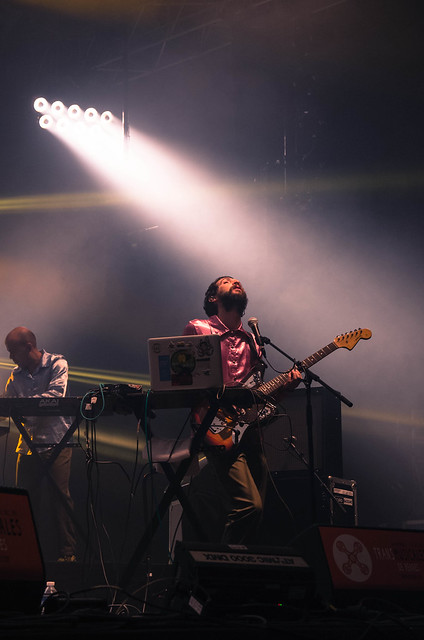

Le vendredi s'est exactement passé comme on ne l'avait pas prévu. Arrivé trop tard, on a raté The Skins, Nova Heart et Les Gordon. Au parc expo, Carole nous montre son CD dédicacé de [Joy Wellboy](https://soundcloud.com/joy-wellboy) qui jouaient aux bars en trans juste avant. Leur concert était très bien semble-t-il.

Justement, en se précipitant pour voir la fin de Les Gordon, on se retrouve devant Stromae. L'accès est bloqué pour les suivants, le hall 9 est plein. On se dit que maintenant qu'on est ici, autant y rester. Noir. Ovation du public à son arrivée "Rennes! Rennes! Transmusicalien! Transmusicalienne!" avec ses r qui trainent, son ton incisif et ses incitations performatives. Il continue "Rennes! Rennes! J'ai fait caca mou avant de monter sur scène". On a encore plus envie de le suivre. Énorme présence, il dirige son public avec ses chapitres et ses interruptions de la musique "c'est moi qui décide". Tout son spectacle tient, ses interludes répondent aux chansons, ses textes sont justement chantés, tout en kitch classe. Pantin désarticulé d'un charlot gris sur un Carmen adapté, MC sur des nappes synthétiques à la limite de la danse FM, il peut tout faire, même interdire aux gradins de rester assis. Il fait de gros bisous à Jean-Louis Brossard pour l'avoir accueilli aux trans en 2010, ce qui l'a révélé. L'alchimie avec le public a lieu. Avant-dernier titre house sans chant, et puis son "papa outé ?" - Ben là, à Rennes, pécho par Stromae.

Après je m'attendais à une grosse teuf disco, des énormes boules à facettes promettent un éclairage assorti ; mais c'est un Hall 9 froid, vidé du public de Stromae qui accueille Horse Meat Disco. Un DJ, alors que j'avais compris que c'était un collectif. Très deep et pas très funky. Du coup la soirée va finalement être un tourbillon entre Hall 9 et 4. On s'y réchauffe dans le Hall 4 devant [Meridian Brother](http://meridianbrothers.com/).

De la musique sud Américaine psychédélique, kitch et délirante. La musicienne de Eblis Álvarez qui fait percu/sax/clavier est bien présente sur le devant de la scène. Les Inrocks [criaient au génie](http://www.lesinrocks.com/musique/critique-album/meridian-brothers-attention-genie/) c'est peut-être beaucoup, mais la description est parfaitement adapté à leur live :

> Electropicalisme, psychotropicalisme, dadaïsme latino, exotica hallucinogène, musiques traditionnelles poussées dans les joyeux confins de l’idiotie, de l’excentricité et de l’avant-garde : on en rêvait, les Meridian Brothers (dont Desesperanza est le quatrième album) le font.

Retour Hall 9 pour Escort : le collectif New Yorkais rempli mieux la scène du grand hall toujours froid et éparse. On vire plus vers du disco/funk oscillant entre un Sister Fledge ("[we are family](http://www.youtube.com/watch?v=eBpYgpF1bqQ)") revival disco et des morceaux plus house. Bonne musique, mais même la belle Adeline Michel n'arrive pas à remplir la salle.

La green room est pleine.

On va écouter le zèbre "DJ prosper" au hall 4 : mix très varie entre Amérique du sud et gros binz électro dansant. Plus d'ambiance ici alors qu'il assure l'intérim entre Meridian Brothers et les prochains Melt Yourself Down. Décomplexé, il s'amuse, c'est communicatif.

On retiendra aussi Crystal Ark : chanteuses black superbe aux voix enchanteresses sur électo crade avec percu et orgue. Très house hypnotique par moment.

Public service Broadcasting. Des anglais à lunettes. Encore une surprise ! On s'attendait à quelque chose de planant, lent, statique et synthétique, c'est en fait organique, rock et noisy avec à la base une electro qui tape et un fil conducteur assuré par des samples de diffusion radio (ou immitation) tres british - trop présents ? - :

<blockquote class="twitter-tweet" lang="fr">
En fait, Public Service seraient géniaux sans les Broadcastings <a href="https://twitter.com/search?q=%23Trans2013&amp;src=hash">#Trans2013</a>
— Thomas Folliot (@silenthype) <a href="https://twitter.com/silenthype/statuses/409166123901677568">7 Décembre 2013</a></blockquote>

Comme dit Samuel c'est "old school mais hyper moderne".

Avant de partir, on va faire un dernier tour devant Frikstailers : électro a la major laser avec des rythmes sud américains. Bien, mais un peu mort pour en profiter pleinement. Fini. Taxi.

Bonne soirée, un peu à contre-pied, avec cet effet Stromae qui a vidé une bonne parti du public, et ce hall 9 un peu grand pour le reste de la soirée.
