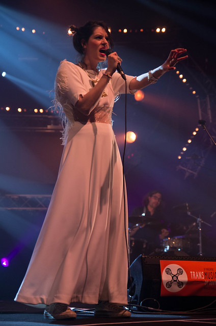
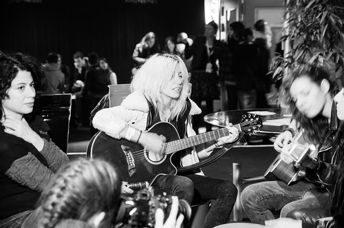
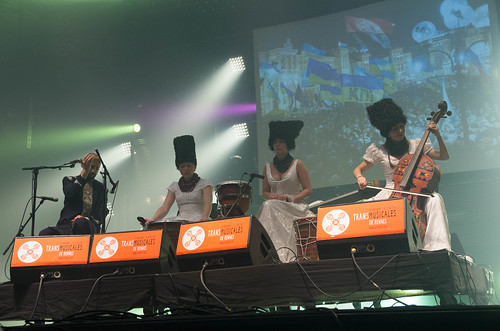
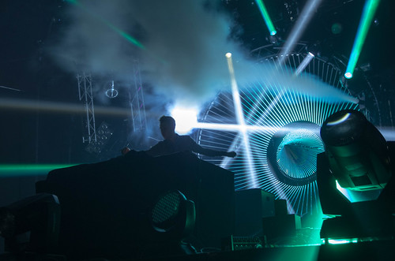

Après la traditionnelle galette de la place Ste Anne, la bolée de cidre, la rédaction du vendredi et un wok comme dîner, direction le parc expo pour la dernière soirée. Nous avons juste le temps de voir quelques chansons de **Iva G. Moskovich** : Dans une grande robe blanche, la prêtresse nous emmène plutôt vers le rock noir de son ancien groupe [Drop Out Venus](https://soundcloud.com/dropoutvenus) : ressemble alternativement à PJ Harvey ou plus pop comme son dernier titre.

Nous avons aussi eu des nouvelles de **Nova Heart** qui ont fait un bon concert nous a-t-on dit.

Après un petit verre, nous allons voir **Fakear** : minimalisme créatif, pour un jeune DJ. Il se donne à fond, est ému d'être devant ce public conquis. C'est de la house festive intelligente qui a des choses à dire. Nous nous laissons prendre dans les premiers rangs, ce sera la première claque de cette soirée. Fakear c'est « pointu » -- mc

Nous partons voir quelque chose de plus organique, dans le hall 3 : **Daughn Gibson**. Du rock viril et sombre, une voix à la Bruce Springsteen des premières heures, avec les intonations graves d'Iggy Pop. Son rock est moins route 66 qu'il n'en avait l'air dans ses vidéos, il reste sobre dans son jeu de scène.

...pendant ce temps... au VIP le DJ passe Jan Hammer et nous tombons sur ce petit concert impromptu :

Nous retrouvons le hall 4 et ses voyages musicaux, c'est Abrakhabraka euh **DakhaBrakha**, une voix d'homme et trois femmes. ils sont en même temps 3 aux percussions et une au violoncelle. Leurs voix entêtantes emplissent l'espace du hall 4 tourbillonnent, nous enlèvent vers leurs plaines d'ukraine. Le chanteur sillonne ces chants avec un mégaphone (dont je ne connaissais pas l'étendu des possibilité de sons). Les rythmes rapides et dansants communiquent une transe « magique » -- mc. Énorme réception du public et un rappel, c'est suffisamment peu fréquent pour le mentionner.

Retour au hall 9 pour **Boston Bun**. C'est la session "tech qui bastonne" -- mc : les samedi vers 1h dans le hall 9 on retrouve une certaine continuité : Vitalic, Mr Oizo, TNGHT. Celle-ci est plus digeste sans prendre de truc que les autres années : son moins écrasant, plus sucré, mélodies synthétiques cristallines, plus de place, les boules à facettes scintillent, c'est maintenant la teuf du hall 9.

Pendant ce temps au VIP : should i stay or should i go. Ahem. I go.

En déambulant dans les allées et les salles, on retrouve le public des trans, ni London Grammar ni Stromae, réceptif, pointu, déconnant, agité. On retrouve nos stéréotypes, les cools dans les gradins qui roulent des joins, la fille déguisée de la tête au pieds en lapin immobile et hagarde devant une porte, ceux qui sautent pendant 3h, torse-nu alors qu'il fait 2°, ceux qui posent leur galette, ceux qui récupèrent allongés par terre, ceux qui ont perdu leurs potes et qui pleurent au téléphone, ceux qui rient et parlent très fort, ceux qui se disputent, ceux qui se chopent au milieu d'une foule bondissante, ceux qui regrettent le Liberté, ceux qui dansent en se laissant bercer, ceux qui chantent, ceux qui commentent, ceux qui slamment, ceux qui passent la nuit au bar VIP...

On est passé voir **Lonnie Holley**, dans le genre inclassable, seul avec son orgue Nord rouge : quand la musique devient l'expression des sentiments profonds, ceux qu'on ne peut pas dire. **Kid Karate**, à deux sur scène : l'un à la batterie, l'autre à la guitare. Cela donne un rock brut et épuré, certaines chansons sont beaucoup plus fournies : mais elle sort d'où la musique qui n'est ni guitare ni batterie ? On a aperçu aussi Hall4, **Ibibio sound machine** : afro énergique tout en saccade avec un gros niveau musical. Aussi la délicatesse de **Louisahhh !!!** Un spectre sombre se tenant bien droit et qui a l'air d'effleurer ses machines.

Et puis on a continué dans le hall 9 avec **Joris Delacroix** : gros réacteur lumineux derrière lui, pour son projet Boarding Pass. "il a fait décoller le hall 9" -- mc. Très varié, il passe très rapidement de tech minimale à gros blast enveloppant. Vers la fin c'est une grosse machine qui défonce. Et enfin **Konstantin Cibold** : house minimale toute en finesse après une intro bourrine. "Impérial ce soir" -- mc

Rentrés avec radio nostalgie dans le taxi. Claque de réalité...

"Allo ? Est-ce que vous voulez prolonger votre chambre ? - non non je vais partir à 12h - c'est à dire qu'il est 12h44 - mais non - si ! 1/4h pour me lever, m'habiller, faire mon sac et prendre mon train.

PS : merci à mc pour ses blagues de titres de 20mn, ses suggestions, et à Carole pour ses références.
