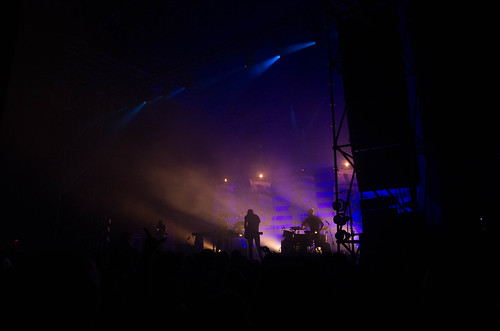
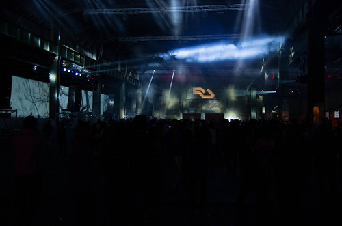

Dur de trouver un moment pour mettre sur écran mes impressions de cette 12e édition des nuits sonores.

Arrivée jeudi pour reprendre contact avec la tech minimale de la jolie russe [Nina Kravitz](https://soundcloud.com/nina-kraviz) qui avait fait polémique sur la sexualisation de la musique électro avec notamment la sortie de son film [Between The Beats](https://www.youtube.com/watch?v=5TkSsq344K8). Son mix est propre mais personnellement, est-ce l'heure précoce ? Je ne trouve pas de chaleur dans son set, et ça tape trop vite pour se mettre dans l'ambiance. On zappe le reste de la soirée.

Le lendemain, après avoir arpenté la ville, j'arrive à 16h30 pour [Konstantin Sibold](https://soundcloud.com/konstantinsibold) en super forme, bien plus énervé qu'aux transmusicales où il avait joué un set un peu mou.

[Ten walls](https://soundcloud.com/tenwallsmusic) joue deep avec son sample pachydermique fait de tuba trafiqué, il rempli complètement la salle, nous picote l'épiderme. C'est contrasté, bien fait, avec des rythmes qui prennent un peu dans un contre pied énergique et mélodique. Classe comme son titre Walking With Elephants : 

<iframe width="100%" height="450" scrolling="no" frameborder="no" src="https://w.soundcloud.com/player/?url=https%3A//api.soundcloud.com/tracks/140546638&amp;auto_play=false&amp;hide_related=false&amp;show_comments=true&amp;show_user=true&amp;show_reposts=false&amp;visual=true"></iframe>

Dixon : minimale deep hypnotique entêtante bien dark comme on l'attendait. L'ambiance contraste sévère avec [Rich Aucoin](http://www.richaucoin.ca/) dans le hall d'à côté qui dans une brute pop rock complètement débridée descend chanter en sautant au milieu de la foule sous un énorme drapeau.

Direction marché gare. Pas de soucis contrairement à la bousculade du mercredi soir. J'adore les immenses écrans disposés un peu partout, qui diffusent des images de nature, la terre qui brûle, un 747 en vol. Les images contrastent avec l'environnement industriel en béton et métal. Je commence par un truc original [la colonie de vacance](http://papiertigre.com/lacoloniedevacances/) trash avec 4 groupes qui joue d'un seul. En quadriphonie hall3 ça envoie. Du rock en nappes à 120bpm qui se renvoient la balle. Juste techniquement c'est chaud.

[Four Tet](http://www.deezer.com/artist/1744) est présent au rendez-vous rythmé deep et sexy. Le kif de la soirée en ce qui me concerne, il apporte un peu plus de finesse que ce qu'on a entendu (à part Ten Walls). [Fulgeance](http://www.deezer.com/artist/157156) fait un gros travail sur le son, le triture dans tous les sens fait une entrée fracassante. Puis il enchaîne avec du gros dubstep qui tache, mais paraît-il que c'était bien ensuite.

Et puis [Shed](http://www.discogs.com/artist/97364-Shed) grosse tech (encore et encore) bourrine quand j'y suis passé mais pas le courage de rentrer dedans.

Samedi nous avons loupé [Jacques Green](https://soundcloud.com/jacquesgreene) à la sucrière, dansant d'après Carole. Nous sommes arrivés pour Deetron, tout naze comme de la tech FM. Au marché gare, c'est [Valentin Stip](https://soundcloud.com/valentinstip) qui nous accueille. C'est deep, il est jeune et appliqué. Sympa pour retrouver la foule qui s'amasse, oscillante d'un pied sur l'autre, comme en attendant la transe. Bonne introduction, comme ce morceau afro de Michel Cleis qui passe tout seul.

[Efdenim](https://soundcloud.com/efdemin) c'est allemand c'est carré avec de longues transitions répétitives comme un régime de diesel de cargo, sur fond de battements lourds. Je n'y trouve rien d'intéressant alors je vais voir du rock : The [Brian Jonestown Massacre](http://www.brianjonestownmassacre.com/) : ça ressemble à de la brit pop noisy et pourtant ils sont américains. Ils chantent alternativement, avec une voix a la Kasabian ou encore un Nick Cave. Il sont 4 grattes une basse une batterie. Ça c'est du rock!

Après une petite pause dans ce hall 1 avec Django Django en musique de fond, c'est [Trentemøller](https://soundcloud.com/trentemusic). Le son est froid, très 80 c'est d'ailleurs un concert sous influence de cure avec 1 clin d'oeil et une reprise, et la voix de [Ann Trolle](http://www.anetrolle.com) (à vérifier) aux accents de Siouxie and The banchies. Formation quand même assez analogique, une basse, deux guitares, batterie, et machines/clavier. Arpèges synthétique, passages chaotiques saturés de guitares, d'autres très mélodiques, guitare noyée dans la réverbération, c'est varié, à presque en devenir bordélique, passant du mièvre au trash. Mais il y a aussi des moments de grâce musicale avec un morceau qui reprend la descente de guitare de "Just like heaven" des cure, enfin, une version originale de Moan mélangée avec "Lullaby" pour finir.

[Actress](http://www.discogs.com/artist/211501-Actress) pour la descente mélopées athmospheriques et petits bruits chelous pour se reposer d'Agoria, juste à côté dans le hall 2. Au fil des ans, ses sets faits d'une lente houle régulière de montées et descentes d'une techno répétitive minimale ne changent pas beaucoup. Comme disait Baptiste, quand on est jeune, on a besoin d'évacuer de l'énergie, maintenant je n'accroche plus à cette tech parfois quasiment réduite à un beat. Un peu de renouvellement ce serait cool.

Puis passage à [Suun](http://secretlycanadian.com/artist.php?name=suuns) rock noisy et synthétique, parfois réduit à une simple expression de bruits un peu flippants, et puis duquel on distingue, un peu comme une fleur au milieu d'un pierrier, une mélodie, une ligne de basse. On enchaîne après sur une mélodie arabe acapella saisissant. La transe vient de leurs sons, et non du rythme comme c'est souvent le cas.

Au final, ils ont battu leur score d'affluence avec 130 000 spectateurs. Bravo à l'orga, c'est chaud time pour faire tourner une machine comme ça. En ce qui me concerne c'était en demi teinte. J'ai aimé les écrans, le site du marché gare, le fait d'avoir un quartier habité par la musique, l'idée d'avoir des débats autour de l'événement. Pour avoir kiffé pleinement, il m'aurait fallu une ou deux claques, moins de tech et plus de house, un peu plus de finesse, une montée plus douce avec des NS days moins bourrins. Je m'aperçois quand je regarde en arrière qu'à part certains passages de nuit comme Enrik Schwartz aux usines SLI, les moments magiques, c'était à la piscine du Rhône.

- EDIT : le 20 juin pour prendre en compte les remarques de Carole
