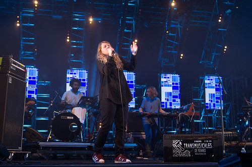
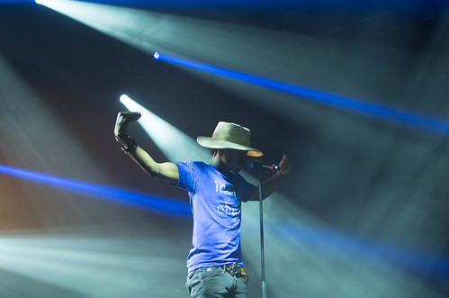
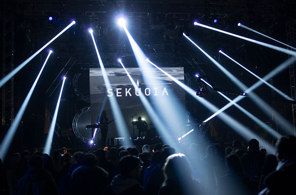

Le temps du checkin, poser les affaires, manger un bout, nous arrivons au Parc Expo vers 22h30, juste après **[Courtney Barnett](http://courtneybarnett.com.au/)**. Pareil pour **[Jeanne Added](https://myspace.com/jeanneadded)** mais il y a des sessions de rattrapage, elle passe tous les soirs à l'Air Libre.

Pas encore grand monde au parc expo, ça nous permet de voir les installations de cette année : une nouvelle aire de jeu, le hall 8 qui semble être de taille comparable au hall 3 (~2000/3000 personnes). pour aller au hall 3 on passe par la green room qui rempli tout le hall4 (avant c'était juste un coin électro sponsorisé par une marque de bière).

C'est **[Curtins Harding](https://www.facebook.com/pages/Curtis-Harding)** qui joue Hall8. Ahhhhh toujours impressionné en arrivant aux trans par le bon son, sec avec du relief. Curtis harding c'est une sorte de Lenny Cravitz soul-rock, des fois un peu aproximatif niveau justesse. La musique elle, déroule bien, les musiciens sont brillants, et le tout cohérent. Le premier rang lui crie : "Curtis your fly ... Is open !"

On va chercher une bière au bar VIP, le temps de faire la blague traditionnelle "Bruno j'te laisse au club trans" et je pars voir **[Kate Tempest](http://katetempest.co.uk)**. Intro électro puis slam à capella enchaîné en souplesse avec un gros son groove et électro. La tempête slam : on est pris dans les flux et reflux de ses paroles, elle accélère, ralentit, casse ses rythmes, la musique est assurée par une fille à l'orgue/sample, et deux batteries dont une électronique. Une autre chanteuse/rapeuse pose sa voix en duo avec elle. Belle harmonie entre rap qui claque aux rythmiques beasty-boysiennes avec la diction d'un Eminem anglais. La musique électronique est rapide et bien actuelle. Emotion, on est dans le son. Le hall quasi vide au départ est rempli, elle paraît presque surprise de l'accueil, et ponctue le concert avec "Thank you for beeing fucking lovely". La classe. La première claque du festival.

Je suis le flux des transmusicaliens sous la bruine pour voir le jeune phénomène **[Raury](https://soundcloud.com/raury)**. A 20 ans, il a une sacré présence sur scène, une attitude de rock star dans ses déplacements, ses vacillements. Il chante, rappe, joue de la guitare, se donne à fond. Gros talent. Il reprend nirvana, ce qui provoquera cette remarque décalée de notre voisin : "il a le droit de reprendre nirvana mais pas avec des stroboscopes". Et nous, on prend un aller-retour dès le début du festival.

On part vers le proche orient avec [**A-Wa**](https://www.facebook.com/awaofficial). 3 chanteuses avec basse/guitare/batterie/percus, une sorte de rock yéménite entêtant. Leurs voix puissantes en monophonie éclatent en trio. Captivant.

Après un passage par le hall 4 résolument électro avec Andre Bratten -- gros gap techno je crois que je commence à avoir du mal avec l'électro-tech -- on va se calmer avec les danois de **[Sekuoia](https://soundcloud.com/sekuoia-1)** et notamment Patrick Alexander Bech-Madsen. Il est accompagné de 2 musiciens. Downtempo, électro pop lente, bruiteuse, ils sont appliqués. Ils nous embarquent dans leurs divagations sonores.

Et puis je finis la soirée sur Molotov Jukebox, annoncés par Jean Louis Brossart himself, un peu comme du négresse verte avec une Marilyn brune au chant et à l'accordéon. Ambiance festive.

Petit tour par le hall 4, cette fois-ci c'est F.E.M qui remixe [Crispy Bacon](https://www.youtube.com/watch?v=6SFD7fz8fWc), je vais prendre le bus.
