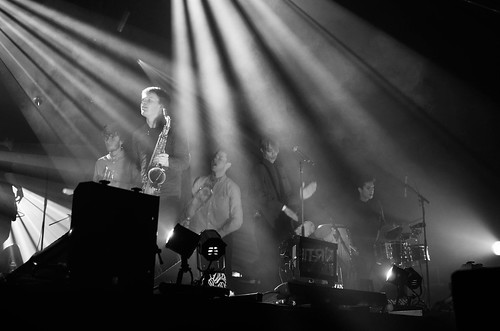
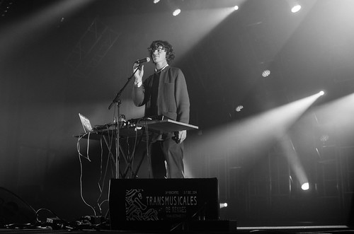

Grosse soirée. Le parc expo affiche complet, et la programmation est... impossible à couvrir à la hauteur de ce qu'on voudrait y voir.

Nous arrivons à la fin de **[Dad Rocks!](http://music.dadrocksmusic.com/)** Grande générosité et plaisir de jouer. Je m'attendais à une formation plus intimiste, mais il y a du monde sur scène pour enjoliver les ballades folk. Ca sent le voyage, ça ferait une bonne playlist de road trip, on se voit bien sur des routes scandinaves perdues, avec les fenêtres ouvertes. Ils vont d'ailleurs rejouer en France en février pour le festival [GéNéRiQ](http://generiq-festival.com/). Chaleureusement conseillé.

On retrouve le grand hall 9 pour **[Jungle By Night](https://www.facebook.com/junglebynight)**, des néo-zélandais qui jouent du Afro Jazz funk fusion. Ils sont 10 sur scène. Une section de cuivre saxo-trompette-trombone est bien présente au coeur du groupe, elle est accompagnée de deux percussionnistes, un orgue, une batterie. Ambiance bon enfant leur amusement est communicatif. Le chanteur fait un show qui cherche résolument du côté de James Brown. Il font reprendre leurs chorégraphies par le public : "don't be shy to show your moves". Ils sont djeuns mais très au point. Leur énergie prend le pas sur une impression de déjà-vu.

Méta Méta dans le hall 8 latino-rock chaloupé. Passages plus destructurés. Bizarre, dans nos écoutes, nous avions eu l'impression de quelque chose de plus abrasif... smoky sax à la [Morphine](http://fr.wikipedia.org/wiki/Morphine_%28groupe%29). Puis boum! Gros rock indé bien brutal. Intéressante synthèse entre musique sud-américaine et rock indé qui tâche.

La soirée commence très cuivres, jazz, rock, musique du monde ça change. L'électronique reprend ses quartiers hall 9 avec The Avener. On est accueilli par "right here right now" des fat boy slim, dj assez classique big beat mélodieux : il en chaîne un peu plus tard avec "[gonna take for a ride on big jet plane](https://www.youtube.com/watch?v=yFTvbcNhEgc)" de Angus et Julia Stone. Son mix est propre, énergique. C'est un peu de la musique qui va puiser des références de quarantenaires, mais le hall est rempli de plus jeunes.

Nous ratons Rone, entrée bloquée, le hall 9 affiche complet. On se console, nous l'avions vu aux Nuits Sonores.

On se rend hall 3 pour **[Cosmo Sheldrake](http://www.cosmosheldrake.com/)** le magicien des machine ou homme orchestre du 21e siècle. Il se sample, se boucle, joue du pad, fait beat box, chante, trafique les sons, remixe des bruits de poisson-perroquet pour nous faire une musique résolument novatrice. On retrouve aussi l'esprit DIY musical. Il est très détendu. Sa voix quand elle n'est pas trop modulée fait parfois penser à du Alt-J. Il sait tout faire. Il représente bien cette nouvelle génération de musiciens très à l'aise avec les machines et qui profitent avec virtuosité de toutes leurs possibilités. On en reparlera forcément.

Hall 8 pour **[Naked (on Drugs)](http://nakedondrugs.bandcamp.com/)**. Dans le genre musique qui gratte, rock barré à la Nick cave très dark. C'est d'ailleurs un des rares groupes de ce soir qui soit aussi difficile et sombre. On enchaîne avec [**DBFC**](https://soundcloud.com/dbfc) électro-pop, sorte de Django Django avec David Shaw celui qui a repris [Infected](https://www.youtube.com/watch?v=HwYfMU9ehZ8) des The The (forcément quelqu'un de bien). C'est aussi le fondateur du label "Her Majesty's Ship Reccord", label de La Mverte (dont nous avons fait une interview cette après-midi à venir dans le PB). Hall 8 blindé. Formation simple basse/batterie/guitare/machines. Très eighties parfois un peu dépêche mode sur les basse synthétiques. Ils font aussi penser aux compilations Kistune.

Puis **[Compact Disk Dummies](https://soundcloud.com/compact-disk-dummies)**. Hall 3. Electro-pop. Ils sont deux sur scène très jeunes. L'un est à la programmation, l'autre chante et joue sur son clavier à ressorts. Une sorte de Michael Hutchence qui saute partout.

On ne tiendra malheureusement pas jusqu'au bout pour **[10 Walls](https://soundcloud.com/tenwallsmusic)** et **[Thyacine](https://soundcloud.com/thylacinew)**. Mais on les a déjà acheté.
