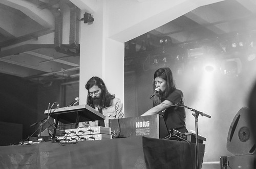

En cherchant mes notes dans [Note Everything](https://play.google.com/store/apps/details?id=de.softxperience.android.noteeverything) sur mon mobile pour l'article des NS 2016, je retombe sur celles de 2015.

Je les pose en vrac, ou presque. Déjà personnellement 2 choses particulières qui contrastent fortement : - je suis descendu avec la famille : Victor, Louise et Nadège. Joie de partager un peu de festival, même si nous étions décalés. Nous sommes allés aux Mini Sonores, les enfants ont adoré. - les amis qui nous ont reçu étaient à l’hôpital, c'était triste. Donc ambiance un peu chelou, ça explique peut-être pourquoi je n'ai rien écrit, va savoir. L'année des boules... à facettes

### Mercredi

[Nils Frahm](https://soundcloud.com/nils_frahm) _ambiant_ variée, nappes d’arpèges au piano et claviers. Super bon accueil du public. Une nouvelle fois syndrome des habitués des machines qui s'extasient - parfois à l'excès - quand des gens font de la musique avec de vrais instruments. Et c'est vrai qu'il y a une vraie respiration, une grande inventivité et un travail sur le son dans le spectacle du Berlinois.

[Factory Floor](https://soundcloud.com/factory-floor) avec un hall2 en long cette fois ci. Nickel. Pas de batteur ce sont des remix de leurs morceaux, ça m'emmerde.

Enfin, "Tale of us" : "musique de pouf" selon Baptiste. Perso, je trouve ça plus [Berghain](http://berghain.de/) que pouf. C'est deep ça me suffit. Mais en écoutant [leur soundcloud](https://soundcloud.com/taleofus) après coup je comprends ce qu'il voulait dire.

### Jeudi

Pause, avec Michel et Carole, nous allons voir JC avec son groupe Pas Riche Hilton. Super soirée _blind test_ entre potes. 

### Vendredi

17h43 : du bon son ! Dans la petite salle. Un barbu avec une fille qui joue du clavier et chante. Un peu du [XX](http://www.thexx.info/) en énervé. Avec des boucles qui semblent devenir incontrôlables, décalées. C'est [Syracuse](https://soundcloud.com/syracuse-886138881) me dit mon voisin. Génial.

On retrouve les potes de Grenoble, Clément et Laurent pour [Dj deep](http://www.djdeep.com/) : excellent comme d'hab un set un peu froid. Suit Moodyman dans le même hall. Un début un peu décousu mais hyper efficace. Étonnant ! Funk peu probable mais qui tient puis très électro puis rap puis house.

[Public service audio broadcasting](https://soundcloud.com/psbhq) pour le coup c'est de la maximale très dense. Nous les avions vu aux transmusicales dans le grand hall 9. Là ça change dans le (petit) hall 3. J'aime bien en écoute mais en live, j'ai plus de mal.

Gros succès des 25 boules à facettes qui montent et descendent.

### Samedi

[La mverte](https://soundcloud.com/la-mverte) avec alexandro paz Dans la continuité de ce qu'il avait fait aux Trans. Froid parfois légèrement industriel. Personnage comme dans l'entretien fume danse boit sur scène. Influence années 80.

Puis The orb le ieuv du djing mix house assagi de la période couleur 3. [Vaudoo game](https://soundcloud.com/apiafo-n) : génial d'énergie afro il nous apporte le vaudou de paix et de funk.

[Rone](https://soundcloud.com/rone-music) très proche de son album. et enfin Voisky avec les boules à facettes du hall 1 qui tournent à plein : 

<iframe src="https://player.vimeo.com/video/167346064" width="500" height="281" frameborder="0" webkitallowfullscreen mozallowfullscreen="" allowfullscreen=""></iframe>

[ns\_2015\_voisky](https://vimeo.com/167346064) from [Bruno Thomas](https://vimeo.com/bamthomas) on [Vimeo](https://vimeo.com).

### Bilan

Une bonne édition des NS 2015, l'année dernière avait été très tech minimale ennuyeuse, cette année c'est réussi, avec ce hall 1 magnifique et pour moi c'est le tandem DJ Deep/Moodyman qui m'a le plus ravi.
