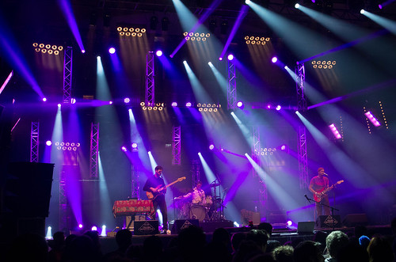

14e année qu'on vient à Rennes pour les Transmusicales. Année un peu spéciale, déjà parce que cette fois nous n'avons pas de pass presse, mais abonnement VIP de la région bretagne. Ca veut aussi dire que nous ne devons pas "produire" des articles sur le festival chaque jour. Et puis je vais pouvoir tester un festival à trois pattes, avec une béquille (cause mauvais claquage au mollet la semaine dernière... ahem, en dansant).

Niveau repérages, je m'étais fait une compilation avec les titres : - [Georgia - Digits](https://soundcloud.com/georgia_hb/digits) - [Dramls - Crushed Pleats](https://www.youtube.com/watch?v=bTiqBq5Nsoc) - [Inüit - Pleyber-Christ city silence](http://thisisinuit.bandcamp.com/track/pleyber-christ-city-silence) - [Mawimbi - World](https://soundcloud.com/wearemawimbi/world-kingayisoba-single?in=wearemawimbi/sets/umeme-afrorave-lp) - [Kaang - Hlalefa](https://www.youtube.com/watch?v=BDcsMSJCurg) - [Her - Quite like](https://www.youtube.com/watch?v=wtuDWKr6Xtc) - [3somesister - Black Hole](https://www.youtube.com/watch?v=cY86NtKEIFU) - [Sau Pauler - Isolated](https://vimeo.com/147455888) - [Applescal - overseas](https://www.youtube.com/watch?v=gP4wBr10rEk) - [Rival Console - Odyssey](https://www.youtube.com/watch?v=nQyBc6cR3GQ) - [Postaal - Freedom](https://www.youtube.com/watch?v=wAfZzFnvmq8)

Mercredi il y avait les deux groupes avec des fautes de frappe sur le "a" : Postaal dont j'avais adoré le titre Freedom et Kaang (afro-electro), mais nous ne pouvions pas y être.

<iframe width="560" height="315" src="https://www.youtube.com/embed/wAfZzFnvmq8" frameborder="0" allowfullscreen></iframe>

# Jeudi

Raté aussi à 16h les nantais de Inuït, qui avaient l'air intéressants avec des formations classiques type conservatoire, [sa voix et le style](https://www.youtube.com/watch?v=bhMY1ngQWZE) me faisant penser à Emilie Simon, et les influences revendiquées autour de Foals, Arcade Fire ou Colin Stetson. Mais j'espère bien pouvoir recroiser leur chemin pour une autre occasion.

Arrivés juste à la fin également de [Her](https://soundcloud.com/thebandher), Ouest France indiquait le lendemain qu'ils avaient séduit tout le Hall 3 avec leur électro pop sexy.

Nous filons hall 3 justement, voir les quatre français des [3Somesister](https://soundcloud.com/3somesisters). Deux chanteurs travestis, une chanteuse et un homme-machines. Une scénographie un peu kitch/queer : avec leurs grandes tuniques blanches, ces trois pharaon(e)s chantent en trio une pop juste rythmée et glamour. Les voix sont magnifiques, les harmonies enchanteresses, mais voila, ça ne tient pas. Je ne sais pas si c'est un problème de balance, de présence, de mise en place, ou d'acoustique : l'impression que la musique et les voix ne se marient pas aussi bien que sur [leur EP Cross](http://www.qobuz.com/fr-fr/album/cross-3somesisters/3610159559341) (chaudement recommandé), nous ne nous retrouvons pas enveloppé dans le groove électrique et puissant de l'enregistrement.

Petite collision de programme, nous voulons aussi voir [Georgia](http://georgiauk.com/), percussionniste de [Kate Tempest](http://katetempest.co.uk) (brit rap/slam vue l'année dernière aux trans : une grosse claque). Direction Hall 8. Il est bien ce hall, le bar est souvent disponible, il y a une ambiance un peu underground et chaude : il n'est pas traversant. On y retrouve une boule de nerf nageant dans un énorme son. Elle en fait des tonnes, court partout, fait ressortir sa voix bien plus que sur l'album, fait de la batterie en chantant, chauffe la salle. Grosse énergie, trop peut-être. Elle n'a pas besoin, Georgia, de nous montrer qu'elle peut prendre le lead, et sortir de son rôle de percu, nous l'avons bien vu sur son album éponyme qui tient, du début à la fin. Ici elle nous a assommé avec un concert assez court ~40mn assourdissant. Souvent quand c'est très fort, c'est qu'il n'y a pas d'histoire à raconter, je suis sûr qu'elle a plein de chose à nous dire.

# Vendredi

Petit tour à l'Ubu en fin d'après-midi pour écouter en partie la dutch connection, notamment Applescal. C'est une bonne techno minimale du nord, mix rapide et efficace, plus club que son album For qui avait un aspect un peu [atmosphérique](https://www.youtube.com/watch?v=wBtkqvtIMFo), aérien comme pour "[For lovers](https://www.youtube.com/watch?v=gPdJiK1Q2Ac)". Parfait pour se remettre dans le son.

Nous arrivons au Parc Expo, cool, pas besoin de carte presse pour rentrer avec un réflex. C'est intelligent, et c'est aussi ça qu'on aime aux trans : une ouverture à la culture, une certaine liberté.

Nous avons loupé de peu The Dizzy Brains, groupe de Madagascar, du rock garage forcément DIY, et avec l'énergie de la rébellion. Tout le contraire de la soupe asceptisée servie sur la plupart des ondes FM. Typiquement le genre trans, d'ailleurs Jean-Louis Brossart (Le créateur du festival) a eu un coup de coeur pour eux, c'est dire.

Puis nous avons pas mal squatté le hall 3, avec d'abord Son Little, "sorte de Marvin Gaye des temps modernes" dixit la programmation. C'est assez juste, Aaron Livingston a collaboré avec The Roots et RDJ2. Blues rock assez classique, et tiré au cordeau, se décalant un peu sur le hip hop et le raeggae.

On reste dans le style même si la forme est complètement différente avec les vieux facétieux de Grand Cannon. Nous avions rencontré Pfuri Baldenweg la veille au soir dehors, prenant un spliff avant le dessert dans le même resto que nous. Nous avions un peu discuté, il nous posait plein de questions, tout le contraire des artistes égotiques et torturés. Leur musique est plus folklorique que le groupe précédent, avec de l'accordéon, de l'harmonica. Bien plus chtarbée aussi, puisque Pfuri nous a joué de l'harmonica et chanté la tête dans un seau d'eau.

Totoro était plus rock hypnotique et classieux. Leur nom est un emprunt au film de Myazaki, et je trouve colle assez bien à la musique qu'ils jouent : élégant, profond et intelligent, d'une apparente simplicité. Mais rien de simple, c'est dense et audacieux, il y a même une trompette, sur du rock c'est plutôt inhabituel. Leur concert donne envie d'écouter attentivement leur album.

Premier contact avec le Hall 9, ça fait toujours quelque chose, avec Workalks, sorte d'euro-dance musicale. Une section corde importante, violons, contrebasse, et guitare électrique se mélangent avec beats et samples. Du gros son propre mais qui caresse un peu trop dans le sens du poil, on aimerait être bousculés, surpris, dérangés par des harmonies un peu Vangélis en plus acoustique.

Mawimbi live toujours au Hall 9. Cinq DJ parisiens qui mélangent sonorités afro-raeggae presque drum'n'bass avec de l'électro. Ils sont à fond derrières leurs platines et leurs consoles, et accompagnés d'un percussionniste aux Djembés, Darboukas... voila un collectif qui fait plaisir à voir, et puis le métissage prend très bien.

# Samedi

[Rival Console](https://soundcloud.com/erasedtapes), électro ambiante assez dark, un son très [Border Community](http://www.bordercommunity.com/) (le label de Nathan Fake et James Holden) la scène n'est presque pas éclairée, et la salle reste dans l'obscurité. Il reprend les morceaux de son album [Odyssey](http://www.qobuz.com/fr-fr/album/odyssey-sonne-bonus-track-version-rival-consoles/4050486110454), et d'autres que je ne connais pas. C'est toujours déstabilisant quand un auteur en électro joue ses morceaux quasiment à l'identique de ses enregistrements. On ne peut pas s'empêcher de se demander ce qu'il fait derrière ses consoles. Cela n'a rien à voir avec la qualité de la composition, mais interroge sur le live : que vient-on voir lorsque l'on est spectateur d'un interprète de musique faite par ordinateur, rejouée par l'ordinateur à l'identique ? Des musiciens inter-agissent entre eux, ne jouent quasiment jamais de la même manière d'une fois à l'autre, s'adaptent à l'accueil du public. Ici on peut dire qu'on vient écouter le système sonore, bénéficier d'une écoute et appréciation collective, d'une ambiance. C'est d'autant plus flagrant quand la musique n'est pas festive, auquel cas, la dance intervient. Le spectacle est vivant par les échanges physiques entre le public. Quand la musique est lente et sombre, avec une mise en scène sobre, c'est plus intellectuel, les personnes sont immobiles, se bercent légèrement dans le noir. Sans doute ont-elles toutes leurs propres images, vagabondages imaginaires, guidés par les mélopées synthétiques et introspectives.

<iframe width="500" height="200" src="https://www.youtube.com/embed/CLBRPrveGM8" frameborder="0" allowfullscreen></iframe>

Cela me faisait penser à ce que disait Günther Anders, dans l'Obsolescence de l'Homme : il avait eu la vision de la recherche d'immortalité par le mouvement machinal des danseurs devant la musique répétitive du jazz à l'époque. C'est complètement applicable à l'électro, encore plus du fait que la musique elle même est faite par des machines, et de la capacité inhérente aux ordinateurs de répéter des séquences d'octets à l'infini. C'est une transe lente, afin de se retrouver dans l'instant, dans la musique, rien d'autre n'existe, ni le passé, ni le futur, ni la mort. Prenez le passage de l'université d'été de Michel Onfray ci-dessus, remplacez "Jazz" par "Electro" et vous avez une vision possible du phénomène. On peut bien sûr ne pas la partager, mais cette analyse qui date des années 60 est quand même frappante de modernité. Pour d'autres cela peut être "Suicidant" comme dit Michel.

Nous allons dans la green room pour voir quelque chose de plus rapide : [Charlotte de Witte](http://www.charlottedewittemusic.com/), de la tech minimale par une jolie DJette Belge. Fine, jeune, super élégante, sans être ni lookée ni mise en avant. Ne nous mentons pas, même si c'est absurde, son esthétique décontractée constitue une bonne partie de l'engouement du public. Allons même plus loin dans un sexisme assumé, il y a une sorte de jubilation devant cette fille debout sur une montagne de machines au centre de la salle, qui envoie du pâté par centaines de watt, en buvant du champagne dans un gobelet en plastique, tirant de temps en temps de manière distinguée sur sa cigarette.

[Monika](http://www.iammonika.com/) : mélange improbable folk, pop, soul, avec une trompette encore, mais avec un son un peu eurovision. Pas trop fan.

Steve and the Seagulls, des reprises façon country par des finlandais. Un banjo sous stéroïdes, qui reprend par exemple le riff de Thunderstruck à 200 à l'heure. Très festif, le hall 3 est plein et l'accueil est bon.

Khun Narin's Electric Phin Band : le groupe Taïlandais qui joue 12 chansons en une pendant 40mn. De la musique traditionnelle avec cet instrument au centre de la formation : le Phin, un luth à 3 cordes, qu'ils branchent sur des pédales de distorsion. Le solo le plus long jamais entendu. Il faut reconnaître au soliste une grand créativité puisque qu'il donnait l'impression de pouvoir tenir plusieurs jours sans jamais se répéter complètement. Mais à la longue c'est un peu usant :

<blockquote class="twitter-tweet" lang="en">
En fait Khun Narin's, c'est comme le Spritz. Un truc chouette là-bas, en vacances, mais sans le moindre intérêt ramené chez toi. <a href="https://twitter.com/hashtag/Trans2015?src=hash">#Trans2015</a>
— Piedo | PALM (@Piedo) <a href="https://twitter.com/Piedo/status/673485333774901248">December 6, 2015</a></blockquote>

[Darius](https://soundcloud.com/dariusofficial) hall 9 house tranquile, groove genre reprise Mojo qui envoie, acid jazz. Limite FM parfois, bonne ambiance dans le hall

Puis [Idiotape](http://www.idiotape.com), des Corée. Ils sont 3 sur scène, deux aux claviers et samples, et une grosse batterie au centre. C'est de la techno qui tape fort. Carole me fait justement remarquer la ressemblance parfois avec Justice.

Du rap Sud Africain dans le hall 8 : [Okmalumkoolkat, Cid Rim & the Clonious](https://soundcloud.com/affine-records/okmalumkoolkat-holy-oxygen), ça ne s'invente pas, et ne se retient pas. Un black avec une grosse présence sur scène, bon flow. Rythmiquement c'est très déstructuré, mais l'ensemble tient bien.

Et puis on se rentre, clap de fin pour ces trans, avec une drôle d'impression. D'abord, nous n'avons pas vu passer ces 3 jours, c'est bon signe. Et puis, le sentiment d'avoir été surtout spectateur et pas acteur : par exemple nous n'avons souvent été au cœur des fosses, dans les chaudrons. Je n'ai pas pris de grosses claques. J'ai pris plus de plaisir à écouter la compilation que j'en avais faite avant de partir que de voir les groupes sur scène (c'est plutôt l'inverse habituellement). Est-ce que la programmation manquait de relief ? Enfin, cela paraît tellement illégitime en tant que spectateur de critiquer ceux qui font, de la musique à fond sur scène, un festival qui s'est déroulé parfaitement, et qu'on adore toujours autant, que je préfère penser que c'est de notre côté que ça déconne cette année.
